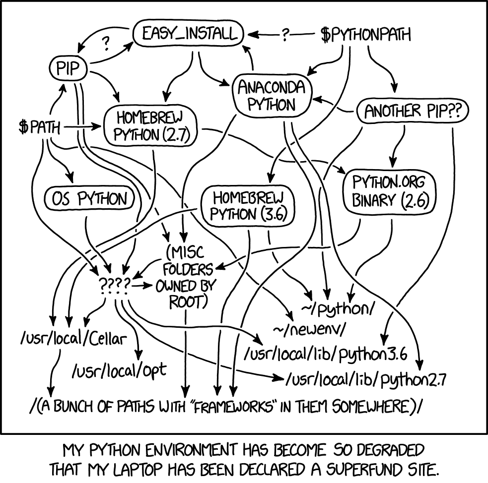

## Agenda do encontro

::: {.agenda}
::: {.bloco}
[00:00]{.tempo} Abertura, combinados e o mapa do curso
:::
::: {.bloco}
[00:15]{.tempo} Por que ainda programar na era da IA
:::
::: {.bloco}
[01:00]{.tempo} Duas estradas: navegador ou computador
:::
::: {.bloco}
[01:20]{.tempo} Intervalo
:::
::: {.bloco}
[01:35]{.tempo} Preparando o ambiente: uv, Git, VS Code e GitHub
:::
::: {.bloco}
[02:05]{.tempo} Primeiros conceitos: objetos, atributos, métodos e módulos
:::
::: {.bloco}
[02:50]{.tempo} Fechamento e o que fazer até o próximo encontro
:::
:::

## O curso em dois blocos

::: {.colunas}
::: {.coluna}
### Curso base

1. **Por que programar** e preparação do ambiente
2. Tipos básicos e funções
3. Condicionais, loops, listas e dicionários
4. Objetos, classes e herança
5. Manipulação de dados com `pandas`
6. Conceitos de IA e engenharia de contexto
:::

::: {.coluna}
### Workshops

1. Dados judiciais com `juscraper`
2. Tratamento de dados e engenharia de variáveis
3. Leitura de decisões com LLMs
4. Análises e visualizações

[Cada encontro tem 3 horas: metade exposição, metade prática em notebook.]{.menor}
:::
:::

## Combinados

::: {.grade .grade-2}
::: {.cartao}
[**Pergunte na hora**]{.titulo}
Se você travou, provavelmente metade da turma travou também. Interromper é
esperado.
:::

::: {.cartao}
[**Ninguém decora sintaxe**]{.titulo}
Consultar documentação, notas antigas e IA faz parte do trabalho. O que não vale
é usar sem entender.
:::

::: {.cartao}
[**Erro não é fracasso**]{.titulo}
Programar é, em boa medida, ler mensagens de erro. Vamos praticar isso desde
hoje.
:::

::: {.cartao}
[**Exercício não é prova**]{.titulo}
Nada precisa ser entregue. Os exercícios existem para gerar dúvidas enquanto
ainda há alguém aqui para respondê-las.
:::
:::

# Por que programar? {.secao background-color="#023A78"}

## Duas perguntas parecidas

::: {.pergunta}
Todo profissional do Direito deveria **ser programador**?
:::

. . .

::: {.centro}
[NÃO]{.resposta .resposta-nao}
:::

. . .

::: {.pergunta}
Todo profissional do Direito deveria **saber programar**?
:::

. . .

::: {.centro}
[SIM]{.resposta .resposta-sim}
:::

## A diferença entre as duas perguntas

::: {.colunas}
::: {.coluna}
### Ser programador

É uma profissão. Exige arquitetura de sistemas, testes, segurança e trabalho em
equipe sobre bases de código enormes.

[Não é o que estamos propondo aqui.]{.menor}
:::

::: {.coluna}
### Saber programar

É conseguir ler o que um código faz, escrever vinte linhas que resolvem o seu
problema e desconfiar de um resultado que não fecha.

[É o que faremos neste curso.]{.menor}
:::
:::

## "Mas a IA não escreve o código por mim?"

Escreve boa parte dele. Três consequências disso:

::: {.grade .grade-3}
::: {.cartao}
[**Mais código, não menos**]{.titulo}
Quando escrever código fica barato, o mundo produz muito mais código. Quem
consegue ler ganha alcance.
:::

::: {.cartao}
[**O erro é plausível**]{.titulo}
Um modelo de linguagem erra com boa redação. O código roda, o número aparece e a
tabela fica bonita, mas o resultado está errado.
:::

::: {.cartao}
[**A responsabilidade é sua**]{.titulo}
Quem assina a petição é você. "O modelo calculou errado" não é tese de defesa.
:::
:::

## O que a IA mudou, e o que não mudou

::: {.comparacao}
::: {.lado .lado-bom}
[Ficou mais fácil]{.titulo}

- Escrever a primeira versão do código
- Traduzir uma ideia em comandos
- Lembrar sintaxe e nomes de funções
- Explicar um código alheio
:::

::: {.lado .lado-ruim}
[Continua com você]{.titulo}

- Formular a pergunta certa
- Saber se o dado responde a pergunta
- Perceber que o resultado não faz sentido
- Assinar embaixo
:::
:::

# Três argumentos a favor do código {.secao background-color="#023A78"}

## Três argumentos

::: {.grade .grade-3}
::: {.cartao}
[1]{.numero}
[**Código é texto**]{.titulo}
Dá para versionar, comparar, comentar, buscar e mandar por e-mail.
:::

::: {.cartao}
[2]{.numero}
[**Código é reprodutível**]{.titulo}
A mesma entrada produz a mesma saída, hoje e daqui a cinco anos.
:::

::: {.cartao}
[3]{.numero}
[**Código é aberto**]{.titulo}
Gratuito, auditável e independente de fornecedor.
:::
:::

## Argumento 1: código é texto

Um programa é um arquivo de texto simples. Daí vêm quatro propriedades práticas:

::: {.grade .grade-2}
::: {.cartao}
[**Cabe em qualquer lugar**]{.titulo}
Em um e-mail, em um anexo, em uma nota de rodapé, em um apêndice metodológico.
:::

::: {.cartao}
[**Aceita explicação**]{.titulo}
Cada escolha pode vir acompanhada do motivo, escrito ali do lado.
:::

::: {.cartao}
[**Pode ser buscado**]{.titulo}
"Onde mesmo eu filtrei por comarca?" tem resposta em dois segundos.
:::

::: {.cartao}
[**Pode ser revisado**]{.titulo}
Outra pessoa lê linha a linha, como leria uma petição.
:::
:::

## Copiar e colar

:::: {.teclas}
::: {.combo}
[Ctrl]{.tecla}[+]{.mais}[C]{.tecla}
:::
::: {.combo}
[Ctrl]{.tecla}[+]{.mais}[V]{.tecla}
:::
::::

Você copia o código de um lugar e cola em outro: do notebook para o e-mail, da
documentação para o seu projeto, da mensagem de erro para a pergunta que vai
fazer.

::: {.fonte}
Não existe equivalente disso para uma sequência de cliques em uma planilha.
:::

## Texto é comparável

O que mudou entre a versão de ontem e a de hoje:

:::: {.diff}
::: {.linha .igual}
[ ]{.sinal} Abrir a base de processos do tribunal
:::
::: {.linha .removida}
[-]{.sinal} Manter só o assunto "Saúde"
:::
::: {.linha .incluida}
[+]{.sinal} Manter os assuntos "Saúde" **ou** "Saúde Pública"
:::
::: {.linha .igual}
[ ]{.sinal} Contar os processos por comarca e por ano
:::
::::

::: {.fonte}
É esse registro que permite explicar por que um número mudou entre duas versões
do relatório.
:::

## O contraste com a interface gráfica

::: {.comparacao}
::: {.lado .lado-ruim}
[Planilha e cliques]{.titulo}

- "Ordenei, filtrei, arrastei a fórmula, colei especial"
- O histórico não existe
- Reproduzir significa refazer, na mesma ordem
- Explicar para outra pessoa significa gravar a tela
:::

::: {.lado .lado-bom}
[Código]{.titulo}

- As mesmas dez linhas, sempre
- O histórico é o próprio arquivo
- Reproduzir significa executar de novo
- Explicar significa mandar o arquivo
:::
:::

::: {.fonte}
Interfaces gráficas são ótimas para explorar. A dificuldade aparece quando o
resultado precisa ser reproduzido ou revisado por outra pessoa.
:::

## Argumento 2: código é reprodutível

A mesma entrada produz a mesma saída: amanhã, daqui a cinco anos e no computador
de outra pessoa. Na prática, essa outra pessoa costuma ser **você mesmo**, seis
meses depois, sem lembrar do que fez.

::: {.grade .grade-3}
::: {.cartao}
[**O parecer contestado**]{.titulo}
A parte contrária questiona o número. Você reexecuta a análise e mostra de onde
ele veio.
:::

::: {.cartao}
[**O dado que atualizou**]{.titulo}
Chegaram mais seis meses de decisões. Você roda de novo, e não refaz a pesquisa.
:::

::: {.cartao}
[**A pesquisa que volta**]{.titulo}
Você retoma o projeto um ano depois e o arquivo explica o que o seu "eu" antigo
fez, sem depender da memória.
:::
:::

## E a escala vem junto

::: {.escala}
::: {.caixa}
[1]{.qtd}
processo
:::

[=]{.sinal-igual}

::: {.caixa}
[40.000]{.qtd}
processos
:::
:::

::: {.fonte}
O código é o mesmo nos dois casos. O que cresce é o tempo de execução da máquina,
e não o seu.
:::

## Argumento 3: código é aberto

::: {.colunas}
::: {.coluna}
### Gratuito

Python, `pandas`, Jupyter, Git, VS Code e todo o resto do curso custam zero. Não
há licença por assento, nem renovação anual, nem limite de alunos.
:::

::: {.coluna}
### Auditável

Você pode abrir qualquer ferramenta que usar e ver o que ela faz por dentro. Um
resultado que depende de uma caixa preta comercial é mais difícil de defender.
:::
:::

::: {.cartao}
[**E independente**]{.titulo}
Ferramenta aberta não é descontinuada por decisão de um fornecedor, não muda de
preço no meio da pesquisa e não deixa de funcionar quando o convênio acaba.
:::

# E o que isso tem a ver com o Direito? {.secao background-color="#023A78"}

## O que dá para fazer com vinte linhas

::: {.grade .grade-3}
::: {.cartao}
[**Organizar arquivos**]{.titulo}
Abrir 400 acórdãos em PDF, achar o número do processo dentro de cada um,
renomear os arquivos e separá-los por ano e por vara.
:::

::: {.cartao}
[**Baixar dados da internet**]{.titulo}
Pegar todos os processos de um tribunal com um filtro, com partes e movimentos,
sem abrir o navegador nem clicar 4 mil vezes.
:::

::: {.cartao}
[**Escrever documentos**]{.titulo}
Gerar 60 ofícios, notificações ou relatórios a partir de um modelo e de uma
planilha, cada um com os dados certos.
:::
:::

::: {.fonte}
Um quarto uso, que retomamos no Encontro 6: conferir, em uma amostra, se o que
uma IA classificou bate com a leitura humana.
:::

## Um exemplo: 400 acórdãos em PDF

::: {.comparacao}
::: {.lado .lado-ruim}
[À mão]{.titulo}

Abrir o arquivo, procurar o número do processo, renomear, anotar na planilha,
fechar. Repetir.

**2 minutos por arquivo, 13 horas de trabalho.**

E, no mês seguinte, chegam mais 400.
:::

::: {.lado .lado-bom}
[Com código]{.titulo}

Um programa lê os 400 arquivos, extrai o número, renomeia e monta a planilha.

**Uma tarde para escrever, 2 minutos para rodar.**

E, no mês seguinte, são os mesmos 2 minutos.
:::
:::

# Duas estradas {.secao background-color="#023A78"}

## Duas estradas, o mesmo destino

::::: {.estradas}
:::: {.faixa}
[Estrada 1]{.rotulo}
[Google Colab]{.nome}

::: {.via}
[abrir o link]{.marco}
[pronto]{.destino}
:::

[Roda no navegador, não instala nada e funciona até no computador da faculdade.
Suficiente para acompanhar todas as aulas.]{.chegada}
::::

:::: {.faixa}
[Estrada 2]{.rotulo}
[Seu computador]{.nome}

::: {.via}
[uv]{.marco}
[Git]{.marco}
[VS Code]{.marco}
[pronto]{.destino}
:::

[Uma tarde de instalação. Em troca: seus arquivos, seus dados, projetos de
verdade e agentes de IA trabalhando sobre eles.]{.chegada}
::::
:::::

::: {.atalho}
As duas se encontram. Dá para começar em uma e mudar para a outra quando quiser.
:::

## Por que a estrada 2 costuma dar trabalho

::: {.quadrinho}

:::

::: {.creditos}
xkcd 1987, "Python Environment", de Randall Munroe. Licença CC BY-NC 2.5.
:::

## O que o uv resolve

::: {.grade .grade-2}
::: {.cartao}
[**Antes**]{.titulo}
Várias instalações de Python no mesmo computador, cada biblioteca em um lugar,
e ninguém sabe qual comando usa qual.
:::

::: {.cartao}
[**Com o uv**]{.titulo}
Uma ferramenta só instala o Python, cria o ambiente do projeto e resolve as
bibliotecas. O ambiente fica dentro da pasta do projeto.
:::
:::

::: {.fonte}
Essa figura é de 2018. O problema é real e antigo, e é exatamente por causa dele
que o Colab existe como alternativa.
:::

## O que vamos fazer no curso

::: {.grade .grade-2}
::: {.cartao}
[**Ensinar a estrada 2**]{.titulo}
As aulas mostram `uv`, Git e VS Code, porque é isso que sustenta um projeto de
pesquisa de verdade e libera as ferramentas de IA mais interessantes.
:::

::: {.cartao}
[**Sem deixar ninguém parado**]{.titulo}
Todo notebook abre no Colab. Se a instalação travar hoje, você acompanha a aula
pelo navegador e a gente resolve o resto com calma.
:::
:::

::: {.aviso-pratica}
**O convite fica aberto.** Quem começar pelo Colab pode tentar a instalação de
novo a qualquer momento até o Encontro 6, quando entrarmos em agentes de IA e o
ambiente local passa de preferência a requisito.
:::

# Preparando o ambiente {.secao background-color="#023A78"}

## Quatro ferramentas

::: {.grade .grade-2}
::: {.cartao}
[**uv**]{.titulo}
Gerencia as versões do Python e as bibliotecas de cada projeto.
:::

::: {.cartao}
[**Python 3.13**]{.titulo}
A linguagem. Instalada pelo próprio `uv`, sem passar pelo instalador oficial.
:::

::: {.cartao}
[**Git e GitHub**]{.titulo}
Git guarda o histórico do projeto no seu computador. GitHub é onde esse histórico
fica publicado e compartilhado.
:::

::: {.cartao}
[**Visual Studio Code**]{.titulo}
O editor. É onde você abre a pasta do projeto, escreve código e executa
notebooks.
:::
:::

## Projeto = pasta = repositório

Ao longo do curso, "projeto" quer dizer sempre a mesma coisa: **uma pasta**.

::: {.projeto}
[minha-pesquisa/]{.pasta}
[.venv/]{.venv} [notebooks/]{.venv} [dados/]{.venv} [resultados/]{.venv} [.git/]{.venv}
:::

::: {.grade .grade-3}
::: {.cartao}
[**A pasta**]{.titulo}
Tudo do projeto mora nela: notebooks, dados, resultados e o ambiente.
:::

::: {.cartao}
[**O repositório**]{.titulo}
É a mesma pasta, com histórico. O Git registra o que mudou, quando e por quê.
:::

::: {.cartao}
[**O ambiente**]{.titulo}
O `.venv` também fica dentro dela. Trocar de projeto é trocar de pasta.
:::
:::

## Um ambiente virtual por projeto

::: {.projetos}
::: {.projeto}
[pesquisa-mestrado/]{.pasta}
Cada projeto declara de quais bibliotecas precisa e em quais versões.

[.venv]{.venv} [pandas 2.2]{.venv}
:::

::: {.projeto}
[relatorio-escritorio/]{.pasta}
O ambiente fica dentro da pasta do projeto, isolado de todo o resto.

[.venv]{.venv} [pandas 1.5]{.venv}
:::
:::

::: {.fonte}
Assim, atualizar uma biblioteca na pesquisa de mestrado não quebra o script do
escritório.
:::

## Criando o seu projeto

::: {.passos}
::: {.passo}
No GitHub, abra o **modelo** do curso e clique em `Use this template`.
:::
::: {.passo}
Dê um nome ao seu repositório. Ele é **seu**, e serve de portfólio.
:::
::: {.passo}
Clone **o seu** repositório com `git clone`.
:::
::: {.passo}
Entre na pasta e rode `uv sync`, que monta o ambiente com tudo instalado.
:::
::: {.passo}
Baixe o notebook da aula com um comando `curl`.
:::
:::

::: {.aviso-pratica}
Os comandos exatos estão no site do curso, prontos para copiar. Só há **uma
pasta**: a sua.
:::

## O repositório é seu

::: {.colunas}
::: {.coluna}
### Por que não clonar o repo do curso

Porque ele é nosso. Você não consegue salvar nada nele, e toda atualização
nossa entraria em conflito com o que você escreveu.
:::

::: {.coluna}
### O que você ganha assim

Um repositório com o seu nome, no seu GitHub, onde `git push` funciona desde o
primeiro dia. No fim do curso, ele é a prova do que você aprendeu.
:::
:::

::: {.aviso-pratica}
Ao final de cada aula: `git add .`, `git commit -m "aula 1"` e `git push`.
:::

## Abrindo o notebook

::: {.passos}
::: {.passo}
No VS Code: `File` e depois `Open Folder...`, escolhendo a pasta do curso.
:::
::: {.passo}
Instale as extensões **Python** e **Jupyter**, ambas da Microsoft.
:::
::: {.passo}
Abra o notebook do Encontro 1.
:::
::: {.passo}
Clique em `Select Kernel` e escolha o `.venv` do projeto.
:::
::: {.passo}
Execute a primeira célula com `Shift+Enter`.
:::
:::

::: {.centro}
[Se apareceu a versão do Python, está tudo pronto.]{.destaque}
:::

# Primeiros conceitos {.secao background-color="#023A78"}

## O notebook

::::: {.colunas}
:::: {.coluna}
Um notebook é uma sequência de **células**, de dois tipos:

- **código**, que executa e mostra o resultado logo abaixo
- **texto**, onde você escreve as anotações da aula

`Shift+Enter` executa a célula atual e vai para a próxima.
::::

:::: {.coluna}
::: {.cartao}
[**A pegadinha clássica**]{.titulo}

O notebook guarda o estado das células **na ordem em que você as executou**, e
não na ordem em que elas aparecem na tela.

Se o resultado ficar estranho, use `Restart` e execute tudo de novo, de cima para
baixo.
:::
::::
:::::

## Tudo em Python é objeto

Um **objeto** é uma coisa que o programa guarda: um número, um texto, uma data,
uma tabela inteira de processos.

::: {.grade .grade-2}
::: {.cartao}
[**Atributos**]{.titulo}
O que o objeto **é**.

Os dados que ele carrega consigo: o ano de uma data, o número de linhas de uma
tabela.
:::

::: {.cartao}
[**Métodos**]{.titulo}
O que o objeto **faz**.

As ações que ele sabe executar: colocar um texto em maiúsculas, mostrar as
primeiras linhas de uma tabela.
:::
:::

## O ponto e o parêntese

::: {.notacao}
[processo]{.alvo}[.]{.marca}ano
:::
::: {.legenda-notacao}
**Atributo.** Sem parênteses. Pergunta um dado que o objeto já tem.
:::

::: {.notacao}
[processo]{.alvo}[.]{.marca}limpar[()]{.exec}
:::
::: {.legenda-notacao}
**Método.** Com parênteses. Manda o objeto executar uma ação.
:::

::: {.notacao}
contar[(]{.exec}[processo]{.alvo}[)]{.exec}
:::
::: {.legenda-notacao}
**Função.** O objeto vai dentro dos parênteses, e não antes do ponto.
:::

::: {.centro}
[O ponto significa "deste objeto aqui". O parêntese significa "execute".]{.destaque}
:::

## Nomes, não caixas

O sinal `=` não é igualdade matemática. Ele dá um **nome** a um objeto.

::: {.grade .grade-2}
::: {.cartao}
[**Leia como "recebe"**]{.titulo}
"O nome `processo` passa a se referir a este texto aqui."
:::

::: {.cartao}
[**Um objeto, vários nomes**]{.titulo}
Dois nomes podem apontar para a mesma coisa. Trocar um deles não muda o outro.
:::
:::

## Módulos

O Python básico é enxuto de propósito. O resto vem em **módulos**, que você traz
para a sessão com `import`.

::: {.grade .grade-2}
::: {.cartao}
[**Biblioteca padrão**]{.titulo}
`math`, `datetime`, `re`, `json`, `random`.

Já vêm com o Python. Basta importar.
:::

::: {.cartao}
[**Bibliotecas externas**]{.titulo}
`pandas`, `matplotlib`, `juscraper`.

Precisam ser instaladas antes, com `uv add`.
:::
:::

## Ler código é a habilidade central

Você vai conseguir explicar o que um trecho de código faz muito antes de
conseguir escrevê-lo do zero. Três perguntas ajudam:

::: {.grade .grade-3}
::: {.cartao}
[**Do que se trata?**]{.titulo}
Qual objeto está sendo manipulado, e o que sai no final.
:::

::: {.cartao}
[**Onde estão as decisões?**]{.titulo}
Que filtros, cortes e critérios foram aplicados, e por quê.
:::

::: {.cartao}
[**O que eu checaria?**]{.titulo}
Qual número deste resultado eu conferiria à mão antes de assinar.
:::
:::

::: {.fonte}
Na prática de hoje você vai ler um código com listas e índices que ainda não
estudamos.
:::

## Quando algo dá errado

::: {.erro}
[Traceback (most recent call last):]{.parte1} 
[&nbsp;&nbsp;File &quot;notebook.ipynb&quot;, line 2]{.parte1} 
[AttributeError:]{.parte2} &#39;str&#39; object has no attribute &#39;uper&#39;. 
[Did you mean: &#39;upper&#39;?]{.parte3}
:::

::: {.erro-legenda}
::: {.l1}
**Onde aconteceu.** No começo, é ruído. Leia de baixo para cima.
:::
::: {.l2}
**O tipo do erro.** `AttributeError`, `NameError`, `TypeError`, `SyntaxError`.
:::
::: {.l3}
**A dica.** Em boa parte dos casos, o Python já sugere a correção.
:::
:::

::: {.centro}
[Nenhuma mensagem de erro estraga o computador. Corrija e execute de novo.]{.destaque}
:::

## Pedindo ajuda, na ordem certa

::: {.passos}
::: {.passo}
**Leia a mensagem de erro.** Em metade dos casos ela já diz a solução.
:::
::: {.passo}
**Use a documentação**, com `help()` ou `Shift+Tab` sobre o nome da função.
:::
::: {.passo}
**Pergunte para a IA**, colando o código e a mensagem completa. E depois **teste
a resposta**, em vez de acreditar nela.
:::
::: {.passo}
**Pergunte para uma pessoa**, dizendo o que queria fazer, o que tentou e o que
apareceu.
:::
:::

## O que a prática de hoje termina fazendo

Você grava 30 segundos lendo um trecho de uma decisão em voz alta, e cinco
linhas de Python devolvem o texto transcrito.

::: {.grade .grade-3}
::: {.cartao}
[**Roda no seu computador**]{.titulo}
O áudio não sai da sua máquina, e não é preciso chave de acesso nem conta em
serviço nenhum.
:::

::: {.cartao}
[**Usa tudo o que vimos**]{.titulo}
Módulo, função, argumento nomeado, objeto, nome e método, na mesma chamada.
:::

::: {.cartao}
[**E erra**]{.titulo}
O modelo pequeno erra termos jurídicos. Encontrar esses erros é o exercício
final da aula.
:::
:::

## Mão na massa

::: {.aviso-pratica}
Abra o notebook do Encontro 1, no VS Code ou no Colab.

Vamos fazer os exercícios juntos, em blocos. Levante a mão sempre que travar.
:::

::: {.grade .grade-3}
::: {.cartao}
[**Parte A**]{.titulo}
O notebook, objetos e nomes
:::
::: {.cartao}
[**Parte B**]{.titulo}
Atributos, métodos e módulos
:::
::: {.cartao}
[**Parte C**]{.titulo}
Transcrever um áudio seu e conferir o que a IA entendeu
:::
:::

# Fechamento {.secao background-color="#023A78"}

## O que fica do encontro 1

::: {.grade .grade-2}
::: {.cartao}
[**A tese**]{.titulo}
Não é preciso ser programador. É preciso saber ler e escrever código, porque
código é texto, é reprodutível e é aberto.
:::

::: {.cartao}
[**O ambiente**]{.titulo}
`uv`, Git, VS Code e Python instalados, repositório clonado, notebook rodando com
o kernel do projeto. Ou o Colab aberto, sem culpa.
:::

::: {.cartao}
[**Os conceitos**]{.titulo}
Objeto, atributo, método, função e módulo. Além de ler um erro sem entrar em
pânico.
:::

::: {.cartao}
[**O hábito**]{.titulo}
Antes de cada aula: `git pull`. Durante a aula: trabalhar em uma cópia sua do
notebook.
:::
:::

## Até o próximo encontro

::: {.passos}
::: {.passo}
Termine os exercícios do notebook que ficaram pela metade. O gabarito está no
repositório, mas tente antes de abrir.
:::
::: {.passo}
Se você usou o Colab hoje, tente instalar o ambiente local com calma, seguindo o
tutorial do site.
:::
::: {.passo}
Crie uma conta no GitHub, se ainda não tem. No Encontro 2 faremos *fork* e
*clone*.
:::
::: {.passo}
Abra um `issue` no repositório com qualquer erro que você não conseguiu resolver.
:::
:::

## {background-color="#023A78" .secao}

::: {.centro}

[Obrigado]{.enorme}

Encontro 2: tipos básicos e funções

[lab-dados.github.io/programacao-aplicada-ao-direito]{.pequeno}
:::
