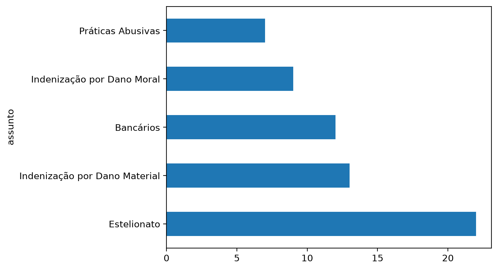
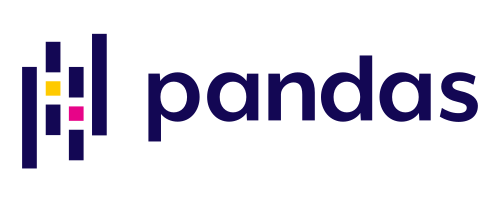
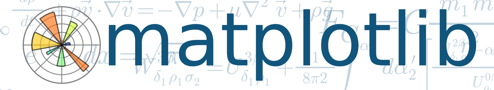
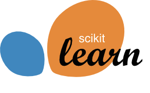
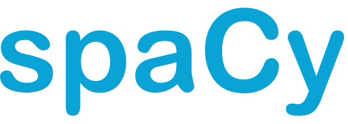
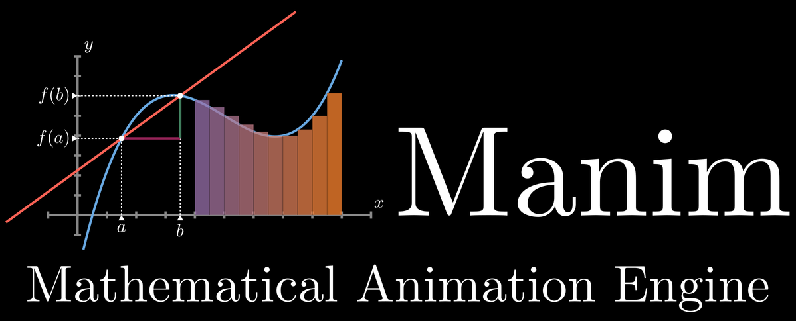
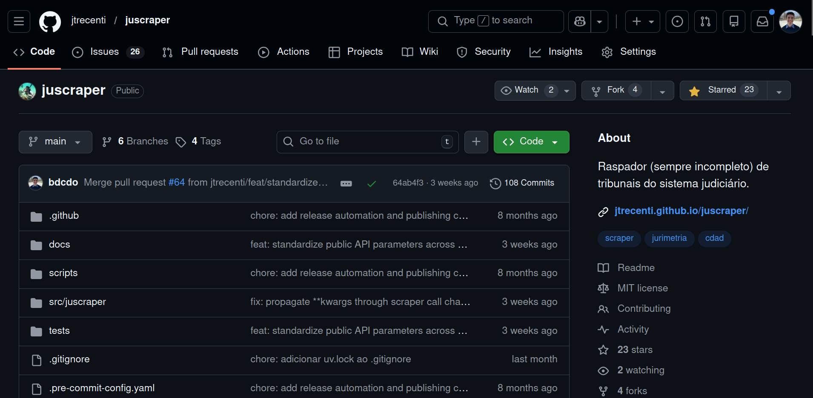

# Revisão: repetir e decidir {.secao background-color="#023A78"}

## Um robô num labirinto

<!-- Tocar aulas/RoboLoopECondicional.mp4 do arquivo local, 73 segundos. O
     video fica fora do repositorio. A ideia a vender: com o que a turma ja
     viu, ela ja saberia dizer a esse robo o que fazer. Deixar a turma ditar
     as regras antes de virar o slide. -->

Enquanto assiste, responda por conta própria:

<span class="espaco"></span>

::: {.grade .grade-2}
::: {.cartao}
[**O que ele repete?**]{.titulo}
Qual é a ação que o robô faz várias e várias vezes, do começo ao fim do percurso?
:::
::: {.cartao}
[**O que ele decide?**]{.titulo}
Em que momentos ele faz uma coisa em vez de outra, e olhando para o quê?
:::
:::

## O robô, em português

<!-- As regras abaixo sao uma leitura do video, e nao o codigo do robo.
     Ajustar a regra do piso colorido ao que o robo de fato faz. -->

::: {.pseudo}
```
enquanto o robô não chegou ao fim do labirinto:
    se há parede à frente do robô:
        virar o robô para o lado sem parede
    senão:
        andar um quadrado para a frente
    se o piso sob o robô é colorido:
        registrar a cor do piso
```
:::

<span class="espaco"></span>

Uma repetição e duas condições. O que falta para programar esse robô é conhecer a biblioteca que fala com os motores e os sensores dele.

## Repetir e decidir, na pesquisa

::: {.comparacao}
::: {.lado .lado-bom}
[No labirinto]{.titulo}

::: {.pseudo}
```
enquanto o robô não chegou ao fim:
    se há parede à frente do robô:
        virar o robô para o lado sem parede
```
:::
:::

::: {.lado .lado-bom}
[Na base de decisões]{.titulo}

::: {.pseudo}
```
para cada decisão da base:
    se o resultado é PROCEDENTE:
        somar 1 em procedentes
```
:::
:::
:::

<span class="espaco"></span>

O `for` visita cada decisão. O `if` decide o que fazer com ela. Toda pergunta de pesquisa sobre uma base vira essas duas frases antes de virar código.

## Sua pergunta de pesquisa, em português

Pense numa pergunta sua, de uma pesquisa que você faz ou gostaria de fazer, e escreva no notebook a repetição e a condição que a respondem. Sem código.

<span class="espaco"></span>

::: {.pseudo}
```
para cada ______________ da base:
    se ______________________________:
        ______________________________
```
:::

<!-- Resposta individual, escrita na primeira celula do notebook. Dois ou tres
     leem em voz alta. Cobrar precisao: qual campo, qual comparacao, qual
     valor. -->

# No notebook: Exercício 1 {.secao background-color="#023A78"}

::: {.aviso-pratica}
Abra o notebook do Encontro 4 pelo link da página do curso: no VS Code, se você instalou o ambiente, ou no Colab, onde vale lembrar de `Salvar uma cópia no Drive` antes de começar.
:::

<!-- Quinze minutos. A pergunta: a tutela e deferida com mais frequencia
     quando o autor e pessoa idosa? for, if e else, if aninhado e quatro
     acumuladores. -->

## Tutela e idade: o resultado

| Grupo | Decisões | Com tutela deferida | Proporção |
|---|---:|---:|---:|
| Autor com 60 anos ou mais | 11 | 10 | 0,91 |
| Demais autores | 29 | 16 | 0,55 |

<span class="espaco"></span>

::: {.grade .grade-2}
::: {.cartao .fragment}
[**O que o loop fez**]{.titulo}
Visitou as quarenta decisões uma vez. O `if` separou os dois grupos, e o `if` de dentro contou as tutelas em cada um. Quatro acumuladores, todos nascidos antes do `for`.
:::
::: {.cartao .fragment}
[**O que o número diz**]{.titulo}
Onze decisões é pouco. A diferença aparece na base, e a base é pequena demais para sustentar uma conclusão. O código conta; quem decide o que a contagem prova é você.
:::
:::

# O objetivo de hoje {.secao background-color="#023A78"}

## Do que dá para automatizar a como usar bibliotecas

::: {.grade .grade-3}
::: {.cartao .fragment}
[**Até aqui: o que é automatizável**]{.titulo}
Variável, condição, repetição, lista e dicionário. Com eles você olha para uma tarefa de pesquisa e sabe dizer se ela vira regra, e qual regra.
:::
::: {.cartao .fragment}
[**Hoje: como isso roda na prática**]{.titulo}
Quase todo código de pesquisa chama o que outra pessoa escreveu. Hoje você escreve classes pequenas para ver como uma biblioteca é por dentro.
:::
::: {.cartao .fragment}
[**O que eu espero de você**]{.titulo}
Que você saia lendo código que usa bibliotecas: qual é o objeto, o que é atributo, o que é método. Hoje você escreve classes para ver como elas funcionam. Na sua pesquisa, quase sempre vai usar as que já existem.
:::
:::

## O código que você vai entender hoje

Leia sozinho: que partes você já entende, e que partes ainda são mistério?

```python
import juscraper as jus

tjsp = jus.scraper("tjsp")
dados = tjsp.cjpg("golpe do pix", paginas=range(1, 11))

dados.shape
contagem = dados["assunto"].value_counts()
contagem.head(5).plot(kind="barh")
```

<!-- Codigo rodado em 21/09/2026 contra o TJSP, sem nenhum import alem do
     que esta no slide: 100 decisoes, 10 colunas. O pandas vem de dentro da
     juscraper. O .plot usa o matplotlib, que precisa estar instalado e nao
     precisa ser importado: o Colab ja traz, e no computador e uv add
     matplotlib. Num notebook o grafico aparece sozinho sob a celula.
     Nao explicar agora. Anotar no quadro o que a turma
     disser que nao entende: import, o ponto, scraper, os parenteses, os
     colchetes. A aula volta a este slide no fim e cobra cada item. -->

## O gráfico que esse código produz

::: {.imagem-cheia}
{fig-alt="Gráfico de barras horizontais com os cinco assuntos mais frequentes entre 100 decisões de primeiro grau do TJSP que mencionam golpe do pix: Estelionato, 22; Indenização por Dano Material, 13; Bancários, 12; Indenização por Dano Moral, 9; Práticas Abusivas, 7."}
:::

<!-- Saida literal das tres ultimas linhas, sem retoque, sobre as 100
     decisoes de 21/09/2026. O resultado muda com o dia da busca. Vale
     comentar: a mesma expressao cai no penal (estelionato) e no civel
     (indenizacao contra o banco). Seis linhas de codigo, da pergunta ao
     grafico. -->

## {background-image="brinquedos-sem-pilha.jpg" background-size="contain" background-color="#000000"}

<!-- Sem titulo e sem dica. Pergunta de viva voz: o que os objetos da
     esquerda tem em comum, e o que o da direita tem de diferente? Esperar a
     turma chegar em "precisam de pilha". So entao virar. -->

# Python não vem com pilha {.secao background-color="#023A78"}

## O que vem e o que não vem com o Python

::: {.comparacao}
::: {.lado .lado-bom}
[Vem na caixa]{.titulo}

Texto, número, lista e dicionário. `if`, `for` e funções. Alguns módulos básicos, como `math` e `datetime`.

É tudo o que você usou até agora.
:::

::: {.lado .lado-ruim}
[Não vem]{.titulo}

Tabelas. Gráficos. Leitura de PDF. Raspagem de tribunais. Transcrição de áudio. Modelos de linguagem.

É quase tudo o que uma pesquisa precisa.
:::
:::

## {background-image="python-r-stata.jpg" background-size="contain" background-color="#000000"}

<!-- R e Stata nascem prontos para estatistica: tabela, regressao e grafico
     ja estao la. O Python nasce geral e vira o que as bibliotecas fizerem
     dele. E por isso que ele serve para estatistica, para site, para robo e
     para IA. -->

## Para quase tudo, já existe uma biblioteca

::: {.logos}
::: {.logo-celula}
[Tabelas e contagens]{.rotulo}

{fig-alt="pandas"}
:::
::: {.logo-celula}
[Gráficos]{.rotulo}

{fig-alt="matplotlib"}
:::
::: {.logo-celula}
[Regressão e testes]{.rotulo}

{fig-alt="statsmodels"}
:::
::: {.logo-celula}
[Classificar textos]{.rotulo}

{fig-alt="scikit-learn"}
:::
::: {.logo-celula}
[Ler PDF]{.rotulo}

[pdfplumber]{.nome}
:::
::: {.logo-celula}
[Ler documento escaneado]{.rotulo}

[pytesseract]{.nome}
:::
::: {.logo-celula}
[Transcrever audiência]{.rotulo}

[faster-whisper]{.nome}
:::
::: {.logo-celula}
[Achar nomes e datas]{.rotulo}

{fig-alt="spaCy"}
:::
::: {.logo-celula}
[Navegar num site sozinho]{.rotulo}

{fig-alt="" height=40} [Playwright]{.nome}
:::
::: {.logo-celula}
[Mapas por comarca]{.rotulo}

{fig-alt="GeoPandas"}
:::
::: {.logo-celula}
[Redes de citação]{.rotulo}

{fig-alt="NetworkX"}
:::
::: {.logo-celula}
[Painel interativo]{.rotulo}

{fig-alt="Streamlit"}
:::
::: {.logo-celula}
[Modelos de linguagem]{.rotulo}

{fig-alt="" height=40} [Hugging Face]{.nome}
:::
::: {.logo-celula}
[Redes neurais]{.rotulo}

{fig-alt="PyTorch"}
:::
::: {.logo-celula}
[Sites]{.rotulo}

{fig-alt="Django"}
:::
::: {.logo-celula}
[Animação]{.rotulo}

{fig-alt="Manim"}
:::
:::

<!-- Para acrescentar funcionalidades ao Python, usamos bibliotecas, tambem
     chamadas de pacotes. Cada celula e codigo que alguem escreveu e
     publicou. A pergunta a fazer a turma: qual destas voce nao sabia que
     dava para fazer com codigo? As bibliotecas do LabDados vem nos slides
     seguintes. -->

## A `juscraper` é uma biblioteca

::: {.imagem-cheia}

:::

## `juscraper`: decisões e processos, direto dos tribunais

Consulta a jurisprudência e o andamento de processos no site de dezenas de tribunais e devolve o resultado numa tabela.

```python
import juscraper as jus

tjsp = jus.scraper("tjsp")
acordaos = tjsp.cjsg("plano de saúde", paginas=range(1, 3))
```

## `raspe`: leis, projetos de lei e notícias

Coleta dados de fontes oficiais e de imprensa: Presidência da República, Câmara, Senado, IPEA, CAPES, Folha de São Paulo e New York Times.

```python
import raspe

presidencia = raspe.presidencia()
normas = presidencia.raspar(pesquisa="meio ambiente")
```

## `labdados`: OCR, transcrição e extração com LLM

Os serviços do escritório de apoio do LabDados, chamados do seu código. Foi ela que transcreveu o seu áudio.

```python
import labdados

labdados.ocr(arquivos="pdfs/", local=True, saida="textos/")
```

## `dataframeit`: um LLM lendo cada linha da tabela

Você descreve as variáveis que quer extrair, e ela aplica um modelo de linguagem a cada linha e devolve a tabela com as colunas novas.

```python
from dataframeit import dataframeit

resultado = dataframeit(decisoes, Codebook, "Classifique o resultado da decisão.")
```

## Instalar e importar

| | O que faz | Quando |
|---|---|---|
| **Instalar** | baixa a biblioteca para o ambiente | uma vez por ambiente |
| **Importar** | avisa ao Python que este código vai usá-la | toda vez que o notebook abre |

::: {.comparacao}
::: {.lado .lado-bom}
[No Colab]{.titulo}

```python
%pip install pandas
```

Numa célula do notebook. A instalação some quando a sessão do Colab acaba.
:::

::: {.lado .lado-bom}
[No seu computador]{.titulo}

```bash
uv add pandas
```

No terminal, na pasta do projeto. O `uv` também anota a dependência no `pyproject.toml`.
:::
:::

```python
import pandas as pd        # igual nos dois lugares, no começo do notebook
```

## De bibliotecas a objetos

::: {.passos}
::: {.passo .fragment}
Para fazer coisas mais interessantes, usamos **bibliotecas**. Ninguém reescreve, a cada pesquisa, um raspador de tribunal ou uma tabela de dados.
:::
::: {.passo .fragment}
Para entender como uma biblioteca funciona, precisamos entender **objetos**. É em objetos que quase toda biblioteca entrega o que faz: o raspador é um objeto, a tabela é um objeto.
:::
::: {.passo .fragment}
Por isso a aula de hoje é sobre objetos. Saber que `df.shape` guarda um dado e que `df.head()` executa uma ação é o que permite ler a **documentação** de uma biblioteca, a **mensagem de erro** e o **código que a IA escreve**.
:::
:::

# No notebook: Exercício 2 {.secao background-color="#023A78"}

<!-- Instalar e importar o pandas. No Colab ele ja vem; no computador, veio
     junto com a labdados. Mesmo assim, uv add pandas: o que o codigo usa, o
     projeto declara. Imprimir pd.__version__. Cinco minutos. -->

# Objetos que você já usa {.secao background-color="#023A78"}

## Tudo no Python é objeto

```python
resultado = "parcialmente procedente"
resultado.upper()              # 'PARCIALMENTE PROCEDENTE'
resultado.count("e")           # 5

from datetime import date
julgamento = date(2026, 9, 1)
julgamento.year                # 2026
julgamento.weekday()           # 1, uma terça-feira
```

Um objeto é um valor que carrega os próprios **dados** e as **operações** que sabem lidar com eles. O texto sabe virar maiúscula. A data sabe em que dia da semana caiu.

## Atributo e método

::: {.notacao}
[julgamento]{.alvo}[.]{.marca}year
:::
::: {.legenda-notacao}
**Atributo.** Sem parênteses. Um dado que o objeto já guarda.
:::

::: {.notacao}
[julgamento]{.alvo}[.]{.marca}weekday[()]{.exec}
:::
::: {.legenda-notacao}
**Método.** Com parênteses. Uma ação que o objeto executa.
:::

::: {.grade .grade-2}
::: {.cartao .fragment}
[**Atributos que você vai encontrar**]{.titulo}
`df.shape`, `df.columns`, `processo.numero`. Respondem "o que este objeto tem?".
:::
::: {.cartao .fragment}
[**Métodos que você vai encontrar**]{.titulo}
`df.head()`, `texto.upper()`, `lista.append(x)`. Respondem "o que este objeto sabe fazer?".
:::
:::

## Função e método

Um método é uma função que mora dentro de um tipo.

::: {.notacao}
len[(]{.exec}[fundamentos]{.alvo}[)]{.exec}
:::
::: {.legenda-notacao}
**Função.** Vive solta. O dado entra entre os parênteses, e ela serve para vários tipos.
:::

::: {.notacao}
[fundamentos]{.alvo}[.]{.marca}append[(]{.exec}"CDC"[)]{.exec}
:::
::: {.legenda-notacao}
**Método.** Age sobre o objeto antes do ponto, e só existe naquele tipo.
:::

::: {.grade .grade-2}
::: {.cartao .fragment}
[**Funções que você já usa**]{.titulo}
`print(x)`, `len(x)`, `type(x)`. Aceitam texto, lista, data.
:::
::: {.cartao .fragment}
[**O método é do tipo**]{.titulo}
`"TJSP".lower()` funciona. `fundamentos.lower()` dá `AttributeError`: lista não tem esse método.
:::
:::

# No notebook: Exercício 3 {.secao background-color="#023A78"}

<!-- Prever, linha a linha, o que e atributo, o que e metodo e o que e
     funcao, e o que cada linha mostra. Uma linha pode ter mais de um: em
     print(julgamento.month) ha uma funcao e um atributo. A armadilha e o
     append: metodo que nao devolve nada e muda a lista. Cinco minutos. -->

# Criando um tipo {.secao background-color="#023A78"}

## A classe é o molde

::: {.comparacao}
::: {.lado .lado-bom}
[A classe]{.titulo}

::: {.pseudo}
```
CLASSE Cachorro:
    nome
    raca
    idade
    latir()
```
:::

Três atributos e um método, definidos **uma vez**.
:::

::: {.lado .lado-bom}
[Os objetos]{.titulo}

::: {.pseudo}
```
rex:  nome "Rex",  raca "vira-lata", idade 3
toto: nome "Totó", raca "poodle",    idade 7
```
:::

Cada cachorro saiu do mesmo molde e carrega os **seus** valores.
:::
:::

::: {.centro}
[`str`, `list` e `date` são classes que alguém escreveu. Você também pode escrever as suas.]{.destaque}
:::

## A classe `Cachorro` em Python

```python
class Cachorro:
    def __init__(self, nome, raca, idade):
        self.nome = nome
        self.raca = raca
        self.idade = idade

    def latir(self):
        return self.nome + ": au au"


rex = Cachorro("Rex", "vira-lata", 3)
toto = Cachorro("Totó", "poodle", 7)

rex.idade          # 3
rex.latir()        # 'Rex: au au'
toto.latir()       # 'Totó: au au'
```

## Um método sem `self`

```python
class CachorroDistraido:
    def __init__(self, nome):
        self.nome = nome

    def latir():
        return "au au"


bidu = CachorroDistraido("Bidu")
bidu.latir()
```

::: {.grade .grade-3}
::: {.cartao}
[**A**]{.titulo}
Devolve `'au au'`, porque o `latir` não usa o nome.
:::
::: {.cartao}
[**B**]{.titulo}
Dá erro: o `latir` não aceita argumento e recebeu um.
:::
::: {.cartao}
[**C**]{.titulo}
Dá erro: o `bidu` não tem um método `latir`.
:::
:::

<!-- A celula esta no notebook, para rodar depois da aposta. -->

## `self`: o objeto antes do ponto

Resposta: [B]{.resposta .resposta-sim}

::: {.erro}
[TypeError:]{.parte2} [CachorroDistraido.latir() takes 0 positional arguments but 1 was given]{.parte1}
:::

<span class="espaco"></span>

Ninguém escreveu argumento nenhum entre os parênteses. Quem passou foi o Python: em `bidu.latir()`, ele entrega o objeto antes do ponto como primeiro argumento do método, e o `latir` não tinha parâmetro para recebê-lo.

## `__init__` e `self`

::: {.grade .grade-3}
::: {.cartao .fragment}
[**`__init__` roda no nascimento**]{.titulo}
`Cachorro("Rex", "vira-lata", 3)` chama o `__init__`. Os três valores entram como parâmetros e saem guardados como atributos.
:::
::: {.cartao .fragment}
[**`self` é este objeto**]{.titulo}
Dentro da classe, `self.nome` quer dizer "o nome **deste** cachorro". O código é um só, e cada objeto responde com o seu valor.
:::
::: {.cartao .fragment}
[**Quem chama não passa o `self`**]{.titulo}
Todo método declara `self` como primeiro parâmetro. Em `rex.latir()`, o `rex` antes do ponto é o `self`.
:::
:::

::: {.notacao}
[rex]{.alvo}[.]{.marca}latir[()]{.exec}
:::
::: {.legenda-notacao}
o Python lê isto como `Cachorro.latir(rex)`: o objeto antes do ponto ocupa o lugar do `self`
:::

# No notebook: Exercício 4 {.secao background-color="#023A78"}

<!-- Acrescentar fazer_aniversario, metodo que muda o atributo idade e nao
     tem return. Resultado 4 7: so o Rex envelheceu. Dez minutos.
     Intervalo depois deste exercicio. -->

# Do dicionário ao objeto {.secao background-color="#023A78"}

## Uma decisão, duas formas de guardar

::: {.comparacao}
::: {.lado .lado-bom}
[Dicionário e função solta]{.titulo}

```python
decisao = {"numero": "1073601-...",
           "resultado": "PROCEDENTE",
           "idade_autor": 27}

ganhou(decisao)
faixa_etaria(decisao)
```

Os dados moram num lugar, as perguntas em outro.
:::

::: {.lado .lado-bom}
[Objeto e método]{.titulo}

```python
processo = Processo("1073601-...",
                    "TJMG", "PROCEDENTE",
                    True, 27)

processo.ganhou()
processo.faixa_etaria()
```

Os dados e as perguntas andam juntos.
:::
:::

## De função a método

::: {.comparacao}
::: {.lado .lado-bom}
[Função]{.titulo}

```python
def resumo(decisao):
    texto = "Processo " + decisao["numero"]
    texto = texto + ": " + decisao["resultado"]
    return texto
```
:::

::: {.lado .lado-bom}
[Método, dentro de `class Processo:`]{.titulo}

```python
    def resumo(self):
        texto = "Processo " + self.numero
        texto = texto + ": " + self.resultado
        return texto
```
:::
:::

<span class="espaco"></span>

Duas trocas. O parâmetro `decisao` virou `self`. O colchete com o nome do campo, `decisao["numero"]`, virou ponto e atributo, `self.numero`. A lógica não mudou.

# No notebook: Exercício 5 {.secao background-color="#023A78"}

<!-- Escrever a classe Processo sozinho: __init__ com cinco atributos,
     ganhou() e faixa_etaria() como metodos. Depois, a celula pronta que
     transforma a base em lista de objetos e conta quem ganhou: 28 de 40.
     Quinze minutos. -->

## Programação orientada a objetos

Os dados e o que se faz com eles andam juntos, num objeto, e o objeto sai de um tipo que nós definimos.

<span class="espaco"></span>

::: {.grade .grade-2}
::: {.cartao .fragment}
[**Com variáveis soltas**]{.titulo}
`numero`, `tribunal` e `resultado` de duzentos processos são seiscentas variáveis para não misturar. No objeto, cada processo carrega as suas.
:::
::: {.cartao .fragment}
[**Com funções soltas**]{.titulo}
Quem chama precisa passar tudo, e saber qual função serve para qual dado. O método já sabe onde está: `processo.ganhou()`.
:::
:::

# Uma tabela em miniatura {.secao background-color="#023A78"}

## O que uma tabela precisa saber

Um `Processo` guarda uma decisão. Falta um tipo que guarde a base inteira e responda perguntas sobre ela.

<span class="espaco"></span>

::: {.grade .grade-3}
::: {.cartao .fragment}
[**Guardar as linhas**]{.titulo}
Atributo `linhas`: a lista de dicionários, recebida no `__init__`.
:::
::: {.cartao .fragment}
[**Dizer o tamanho**]{.titulo}
Atributo `shape`: quantas linhas e quantas colunas, numa dupla como `(40, 8)`.
:::
::: {.cartao .fragment}
[**Mostrar e contar**]{.titulo}
Método `head(n=5)`: as primeiras linhas, com valor padrão para `n`. Método `contar(campo)`: quantas vezes cada valor aparece.
:::
:::

# No notebook: exercícios 6 e 7 {.secao background-color="#023A78"}

<!-- Exercicio 6: Tabela com linhas, shape e head(n=5). Resultado (40, 8).
     Exercicio 7: contar(campo), que e o contar_itens ja escrito, com
     self.linhas no lugar do parametro lista. Vinte minutos. -->

## A `Tabela` pronta

```python
class Tabela:
    def __init__(self, linhas):
        self.linhas = linhas
        self.shape = (len(linhas), len(linhas[0]))

    def head(self, n=5):
        return self.linhas[:n]

    def contar(self, campo):
        contagem = {}
        for linha in self.linhas:
            valor = linha[campo]
            if valor in contagem:
                contagem[valor] = contagem[valor] + 1
            else:
                contagem[valor] = 1
        return contagem
```

<!-- O contar e um for, um if e um dicionario. A lista deixou de ser
     parametro, porque ja mora no objeto. -->

# O `DataFrame` do pandas {.secao background-color="#023A78"}

## A sua `Tabela` e o `DataFrame`

::: {.tabela-grande}
| Na sua `Tabela` | No pandas | O que é |
|---|---|---|
| `Tabela(decisoes)` | `pd.DataFrame(decisoes)` | criar o objeto a partir da classe |
| `tabela.shape` | `df.shape` | atributo |
| `tabela.head()` | `df.head()` | método |
| `tabela.contar("reu")` | `df["reu"].value_counts()` | método |
:::

::: {.centro}
[O `DataFrame` é uma classe. Alguém a escreveu, do mesmo jeito que você escreveu a `Tabela`.]{.destaque}
:::

## O `DataFrame` é criação de alguém

::: {.grade .grade-2}
::: {.cartao .fragment}
[**Um problema de trabalho**]{.titulo}
Em 2008, Wes McKinney trabalhava numa gestora de investimentos, precisava analisar dados e não achou no Python uma ferramenta que servisse. Escreveu a dele.
:::
::: {.cartao .fragment}
[**Código aberto**]{.titulo}
No fim de 2009 ele abriu o código, e desde então gente do mundo inteiro acrescenta métodos. A sua `Tabela` tem dois. O `DataFrame` tem 192.
:::
:::

::: {.grade .grade-3}
::: {.cartao .fragment}
[524 milhões]{.numero}
de downloads no último mês, cerca de 13 milhões por dia.
:::
::: {.cartao .fragment}
[49,8 mil]{.numero}
estrelas no GitHub, e 20 mil cópias do repositório feitas por quem quis mexer no código.
:::
::: {.cartao .fragment}
[192]{.numero}
métodos e 17 atributos num `DataFrame`. Ninguém sabe todos de cor: consulta-se a documentação.
:::
:::

<!-- Numeros de 21/09/2026. Downloads: pypistats.org, ultimo mes, 524.772.986,
     e o numero inclui instalacao automatica por servidor, nao so gente.
     Estrelas e forks: API do GitHub, 49.776 e 20.412. Metodos e atributos:
     contados em dir(pd.DataFrame) no pandas 2.3.3, so nomes publicos.
     Origem em 2008 na AQR e abertura no fim de 2009: pandas.pydata.org/about. -->

## {background-image="dataframe-fight.jpeg" background-size="contain" background-color="#000000"}

<!-- O pandas tem concorrente: o Polars, outra biblioteca com outra classe
     DataFrame, mais rapida em base grande. Dois grupos de pessoas resolveram
     o mesmo problema de dois jeitos. Quem entende objeto troca de uma para a
     outra lendo a documentacao. -->

# No notebook: Exercício 8 {.secao background-color="#023A78"}

<!-- As celulas prontas criam df = pd.DataFrame(decisoes) e comparam
     value_counts com tabela.contar. Exercicio 8: df.columns, df.tail(3),
     df.dtypes e a media de valor_causa, dizendo qual e atributo e qual e
     metodo. Media 73819.56275. Cinco minutos. -->

## O código do começo da aula: criar o raspador

```python
import juscraper as jus

tjsp = jus.scraper("tjsp")
dados = tjsp.cjpg("golpe do pix", paginas=range(1, 11))
```

::: {.grade .grade-3}
::: {.cartao .fragment}
[**`import juscraper as jus`**]{.titulo}
Avisa que este código usa a biblioteca, e dá a ela o apelido `jus`. Ela já precisa estar instalada.
:::
::: {.cartao .fragment}
[**`jus.scraper("tjsp")`**]{.titulo}
Cria um objeto: o raspador do TJSP. Ele guarda dentro de si o que precisa para conversar com o site do tribunal.
:::
::: {.cartao .fragment}
[**`tjsp.cjpg(...)`**]{.titulo}
Método do raspador: consulta os julgados de primeiro grau. Os argumentos dizem o que buscar e quais páginas trazer.
:::
:::

## O código do começo da aula: perguntar à tabela

```python
dados.shape
contagem = dados["assunto"].value_counts()
contagem.head(5).plot(kind="barh")
```

::: {.grade .grade-3}
::: {.cartao .fragment}
[**`dados.shape`**]{.titulo}
O `cjpg` devolveu um `DataFrame`: uma biblioteca entrega o resultado no tipo que a outra criou. `shape` é atributo.
:::
::: {.cartao .fragment}
[**`.value_counts()`**]{.titulo}
Método da coluna `assunto`: conta quantas decisões há em cada um. É o `contar` da sua `Tabela`.
:::
::: {.cartao .fragment}
[**`.head(5).plot(...)`**]{.titulo}
Cada ponto age sobre o que o anterior devolveu: as cinco maiores contagens, e delas um gráfico de barras.
:::
:::

## O raspador do TJSP por dentro

::: {.grade .grade-2}
::: {.cartao .fragment}
[**Atributos: o que ele guarda**]{.titulo}
`tjsp.tribunal_name` é `'TJSP'`.\
`tjsp.download_path` é a pasta onde ele salva o que baixa.\
`tjsp.sleep_time` é a pausa, em segundos, entre uma página e outra.
:::
::: {.cartao .fragment}
[**Métodos: o que ele sabe fazer**]{.titulo}
`cjpg` e `cjsg`: julgados de primeiro e de segundo grau.\
`cpopg` e `cposg`: um processo pelo número, no primeiro e no segundo grau.\
`listar_varas`: as varas do tribunal.
:::
:::

<!-- Conferido no codigo da juscraper 0.3.0. Os nomes dos metodos vem do
     proprio e-SAJ: consulta de julgados e consulta de processos, de
     primeiro e de segundo grau. -->

## O `DataFrame` `dados` por dentro

::: {.grade .grade-2}
::: {.cartao .fragment}
[**Atributos: o que ele guarda**]{.titulo}
`dados.shape` é `(100, 10)`: cem decisões, dez colunas.\
`dados.columns` são os nomes das colunas, entre eles `classe`, `assunto`, `magistrado`, `comarca` e `decisao`.\
`dados.dtypes` é o tipo de cada coluna.
:::
::: {.cartao .fragment}
[**Métodos: o que ele sabe fazer**]{.titulo}
`dados.head()` e `dados.tail()`: as primeiras e as últimas linhas.\
`dados.sort_values("comarca")`: a tabela ordenada por uma coluna.\
`dados.to_csv("golpe-do-pix.csv")`: salva a tabela num arquivo.
:::
:::

<!-- type(dados) e pandas.DataFrame. Os colchetes de dados["assunto"] nao
     sao atributo nem metodo: sao o mesmo acesso por chave do dicionario, e
     o que volta e outro objeto, a coluna, que e o slide seguinte. -->

## A coluna `dados["assunto"]` por dentro

Uma coluna também é objeto, de outra classe: `Series`.

::: {.grade .grade-2}
::: {.cartao .fragment}
[**Atributos: o que ela guarda**]{.titulo}
`dados["assunto"].name` é `'assunto'`.\
`dados["assunto"].size` é `100`, um valor por decisão.
:::
::: {.cartao .fragment}
[**Métodos: o que ela sabe fazer**]{.titulo}
`.value_counts()`: quantas vezes cada assunto aparece.\
`.nunique()`: quantos assuntos diferentes há, aqui `28`.\
`.head(5)` e `.plot(kind="barh")`: os que fecham o código do começo da aula.
:::
:::

<!-- contagem tambem e uma Series: value_counts devolveu um objeto da mesma
     classe, e por isso head e plot funcionam nele. Tres objetos, tres
     classes, a mesma gramatica: objeto, ponto, atributo ou metodo. -->

## Herança: todo tribunal com os mesmos métodos

```python
class BaseScraper: ...                 # o que todo raspador tem

class HTTPScraper(BaseScraper): ...    # recebe tudo de BaseScraper, e acrescenta

class TJBAScraper(HTTPScraper): ...    # recebe tudo de HTTPScraper, e acrescenta
class TJPEScraper(HTTPScraper): ...
```

Uma classe pode nascer de outra e receber os atributos e métodos dela. O nome entre parênteses é a classe mãe.

<span class="espaco"></span>

É assim que a `juscraper` atende dezenas de tribunais com o mesmo jeito de usar: o que é comum foi escrito uma vez, na classe mãe, e cada tribunal só escreve o que tem de diferente.

# Pydantic: o codebook como classe {.secao background-color="#023A78"}

<!-- So se der tempo. Retoma o codebook da decisao: o que nunca falta, o que
     pode faltar e quais valores cada variavel aceita. -->

## O codebook escrito como classe

```python
from typing import Literal
from pydantic import BaseModel

class Decisao(BaseModel):
    numero: str
    resultado: Literal["PROCEDENTE", "PARCIALMENTE PROCEDENTE", "IMPROCEDENTE"]
    tutela_deferida: bool
    idade_autor: int | None
```

::: {.grade .grade-3}
::: {.cartao .fragment}
[**`Decisao(BaseModel)`**]{.titulo}
Herança: a sua classe recebe da `BaseModel` tudo o que sabe conferir dados.
:::
::: {.cartao .fragment}
[**Um atributo por variável**]{.titulo}
Depois dos dois pontos vem o que o codebook permite: texto, verdadeiro ou falso, ou uma lista fechada de valores.
:::
::: {.cartao .fragment}
[**`int | None`**]{.titulo}
A idade pode faltar. A regra para a ausência, que era decisão de codebook, agora está escrita no código.
:::
:::

## O codebook recusa o que não previu

```python
Decisao(numero="1073601-73.2024.8.13.0024", resultado="GANHOU",
        tutela_deferida=True, idade_autor=27)
```

::: {.erro}
[1 validation error for Decisao]{.parte2}<br>
[resultado]{.parte3}<br>
[Input should be 'PROCEDENTE', 'PARCIALMENTE PROCEDENTE' or 'IMPROCEDENTE']{.parte1}
:::

<span class="espaco"></span>

É esta classe que a `dataframeit` entrega ao modelo de linguagem: o LLM lê a decisão e só pode responder dentro do codebook.

# Objetos e IA {.secao background-color="#023A78"}

## Código de IA que usa bibliotecas

::: {.comparacao}
::: {.lado .lado-bom}
[Onde a IA costuma acertar]{.titulo}

Bibliotecas muito usadas, como `pandas` e `matplotlib`. Há milhões de exemplos publicados, e o método que ela escreve quase sempre existe.
:::

::: {.lado .lado-ruim}
[Onde ela erra]{.titulo}

Biblioteca pequena ou recente, como `juscraper`, `raspe` e `labdados`. Ela viu pouco código, e completa com método e argumento de nome plausível.
:::
:::

::: {.grade .grade-3}
::: {.cartao .fragment}
[**Método que não existe**]{.titulo}
`tjsp.buscar_decisoes(...)` parece certo e dá `AttributeError`: este objeto não tem esse método.
:::
::: {.cartao .fragment}
[**Método que já existiu**]{.titulo}
`df.append(...)` saiu do pandas na versão 2.0. A IA aprendeu com código antigo, e o erro é o mesmo `AttributeError`.
:::
::: {.cartao .fragment}
[**Coluna que ela supôs**]{.titulo}
`dados["tribunal"]` dá `KeyError` se a coluna se chama `comarca`. Ela não viu a sua tabela: `dados.columns` responde.
:::
:::

<!-- Os tres erros se resolvem com o que a aula deu: type(x) diz a classe, a
     documentacao da classe lista atributos e metodos, e dados.columns lista
     as colunas. tjsp.buscar_decisoes e nome inventado de proposito. -->

## O que vem depois

::: {.grade .grade-3}
::: {.cartao .fragment}
[**Encontro 5**]{.titulo}
Análise de dados com `pandas`: ler uma base, filtrar, agrupar e contar, agora com o `DataFrame` de verdade.
:::
::: {.cartao .fragment}
[**Encontro 6**]{.titulo}
Como trabalhar com IA de um jeito que evita erros como esses: conceitos de IA e engenharia de contexto.
:::
::: {.cartao .fragment}
[**Workshops**]{.titulo}
`juscraper` e `raspe`, `dataframeit`, o SDK `labdados`, e o que mais interessar a vocês.
:::
:::

## {background-color="#023A78" .secao}

::: {.centro}
[Obrigado]{.enorme}
:::
