---
# ESQUELETO. Cada [A preencher]{.a-preencher} marca um trecho ainda sem
# conteudo. Os comentarios HTML ao longo do arquivo lembram o que as aulas
# anteriores prometeram para este encontro; nao aparecem nos slides.
title: "Conceitos de IA e engenharia de contexto"
subtitle: "Encontro 6 · Programação Aplicada ao Direito"
author: "Luiz Pimenta Filho · LabDados · FGV Direito SP"
date: "2026-10-05"
date-format: long
format:
  fgv-revealjs:
    footer: "Programação Aplicada ao Direito · Encontro 6"
    output-file: slides.html
    chalkboard: true
    include-in-header:
      text: |
        <style>
        /* Tabelas alinhadas a esquerda, em corpo legivel, ocupando o slide. */
        .reveal table { margin-left: 0; font-size: 0.85em; width: 100%; }
        .reveal table td, .reveal table th { padding: 0.3em 0.8em; }
        .reveal table th code { color: #fff; background: transparent; }

        /* Imagem que ocupa o slide, para captura de tela e ilustracao. */
        .reveal .imagem-cheia { text-align: center; }
        .reveal .imagem-cheia img { max-height: 540px; width: auto; border-radius: 4px; }

        /* Marca de rascunho: sai quando o slide estiver pronto. */
        .reveal .a-preencher { color: var(--fgv-cinza); font-style: italic; }

        /* Roteiro da aula: mais itens, corpo menor. */
        .reveal .roteiro-aula .column { font-size: 0.72em; line-height: 1.3; }
        .reveal .roteiro-aula li { margin-bottom: 0.25em; }

        /* Por dentro: das contas às palavras (rede neural, classificador, espaço, LLM). */
        .reveal svg.rede-neural { width: 100%; height: auto; display: block; }
        .reveal .rede-neural text { font-family: Arial, sans-serif; fill: #22303d; font-size: 20px; }
        .reveal .rede-neural .rn-entradas rect { fill: #f5f8fb; stroke: #d3dee9; stroke-width: 2; }
        .reveal .rede-neural .rn-entradas circle { fill: #fff; stroke: #0791d3; stroke-width: 3; }
        .reveal .rede-neural .rn-valor { text-anchor: middle; font-weight: 700; fill: #023a78; }
        .reveal .rede-neural .rn-fios line { stroke: #9ca3af; stroke-width: 3; }
        .reveal .rede-neural .rn-peso { font-size: 19px; font-weight: 700; fill: #5b6b7c; }
        .reveal .rede-neural .rn-produto { font-size: 19px; font-weight: 700; fill: #0791d3; }
        .reveal .rede-neural .rn-neuronio { fill: #023a78; }
        .reveal .rede-neural .rn-neuronio-txt { text-anchor: middle; fill: #dfe9f5; font-size: 18px; }
        .reveal .rede-neural .rn-soma { text-anchor: middle; fill: #fff; font-size: 30px; font-weight: 700; }
        .reveal .rede-neural .rn-limite { text-anchor: middle; fill: #5b6b7c; font-size: 18px; font-style: italic; }
        .reveal .rede-neural .rn-saida { stroke: #5b6b7c; stroke-width: 3; }
        .reveal .rede-neural .rn-disparo { fill: #e6f3fb; stroke: #0791d3; stroke-width: 2; }
        .reveal .rede-neural .rn-disparo-txt { text-anchor: middle; font-size: 19px; }
        .reveal .rede-neural .rn-forte { font-weight: 700; fill: #023a78; }
        .reveal .rede-neural .rn-leg-titulo { font-size: 23px; font-weight: 700; fill: #023a78; }
        .reveal .rede-neural .rn-leg-frase { font-size: 18px; fill: #5b6b7c; }
        .reveal .rede-neural .rn-titulo-cena { font-size: 21px; font-weight: 700; fill: #5b6b7c; }
        .reveal .rede-neural .rn-eixo { stroke: #9ca3af; stroke-width: 3; stroke-linecap: round; }
        .reveal .rede-neural .rn-eixo-txt { text-anchor: middle; fill: #5b6b7c; font-size: 17px; }
        .reveal .rede-neural .rn-eixo-y { text-anchor: start; }
        .reveal .rede-neural .rn-corte { stroke: #22303d; stroke-width: 2; stroke-dasharray: 6 6; }
        .reveal .rede-neural .rn-classe { text-anchor: middle; font-size: 20px; font-weight: 700; }
        .reveal .rede-neural .rn-caso, .reveal .rede-neural .rn-palavra { fill: #9ca3af; stroke: #fcfcfb; stroke-width: 2; }
        .reveal .rede-neural .rn-palavra { fill: #2a78d6; }
        .reveal .rede-neural .rn-rotulo-palavra { font-size: 19px; }
        .reveal .rede-neural .rn-grupo { font-size: 17px; font-style: italic; fill: #5b6b7c; }
        .reveal .rede-neural .rn-frase { font-size: 32px; }
        .reveal .rede-neural .rn-lacuna { stroke: #0791d3; stroke-width: 3; }
        .reveal .rede-neural .rn-vencedora { font-size: 32px; font-weight: 700; fill: #0791d3; opacity: 0; }
        .reveal .rede-neural .rn-rotulo { font-size: 20px; }
        .reveal .rede-neural .rn-barra { fill: #9ca3af; transform-box: fill-box; transform-origin: left center; transform: scaleX(0); }
        .reveal .rede-neural .rn-barra.rn-vence { fill: #2a78d6; }
        .reveal .rede-neural .rn-pct { font-size: 18px; fill: #5b6b7c; opacity: 0; }
        .reveal .rede-neural .rn-nota { text-anchor: end; font-size: 15px; font-style: italic; fill: #5b6b7c; }
        /* As animações só começam quando a cena aparece; antes disso, os passos ficam escondidos. */
        .reveal .rede-neural .rn-passo { opacity: 0; }
        .reveal .rede-neural .fragment.visible > .rn-passo { animation: rn-aparece 0.5s ease forwards; animation-delay: var(--d, 0s); }
        .reveal .rede-neural .rn-caso { opacity: 0; }
        .reveal .rede-neural .fragment.visible > .rn-caso { animation: rn-cai 0.7s ease-in forwards, rn-pinta 0.6s ease forwards;
          animation-delay: var(--d), 2.1s; }
        .reveal .rede-neural .fragment.visible > .rn-caso.rn-esq { --cor: #eb6834; }
        .reveal .rede-neural .fragment.visible > .rn-caso.rn-dir { --cor: #2a78d6; }
        .reveal .rede-neural .fragment.visible > .rn-palavra { animation: rn-espalha 1.2s ease-in-out both; }
        .reveal .rede-neural .rn-rotulo-palavra { opacity: 0; }
        .reveal .rede-neural .fragment.visible > .rn-rotulo-palavra { animation: rn-aparece 0.5s ease 1.1s forwards; }
        .reveal .rede-neural .fragment.visible > .rn-barra { animation: rn-cresce 0.7s ease-out forwards; animation-delay: var(--d); }
        .reveal .rede-neural .fragment.visible > .rn-pct { animation: rn-aparece 0.4s ease forwards; animation-delay: var(--d); }
        .reveal .rede-neural .fragment.visible > .rn-vencedora { animation: rn-sobe 0.9s ease-in-out 1.4s forwards; }
        @keyframes rn-aparece { to { opacity: 1; } }
        @keyframes rn-cai { from { opacity: 0; transform: translateY(-140px); } to { opacity: 1; transform: none; } }
        @keyframes rn-pinta { to { fill: var(--cor); } }
        @keyframes rn-espalha { from { transform: translate(calc(var(--dx) * 1px), calc(var(--dy) * 1px)); fill: #9ca3af; } }
        @keyframes rn-cresce { to { transform: scaleX(1); } }
        @keyframes rn-sobe { from { opacity: 1; transform: translate(-316px, 76px); font-size: 20px; }
          to { opacity: 1; transform: none; } }

        /* Citação sobre o fundo azul dos slides de seção (o prompt do Codex). */
        .reveal .secao blockquote { background: rgba(255, 255, 255, 0.1); border-left-color: #fff; }
        .reveal .secao blockquote p { color: #fff; font-style: normal; }

        /* Demonstração do Claude Code: prints de tela e gráficos que ele gerou. */
        .reveal .print-tela img { max-height: 470px; width: auto; max-width: 100%;
          border: 1px solid var(--fgv-borda); border-radius: 6px; margin: 0; }
        .reveal .print-grande { text-align: center; margin-top: 0.2em; }
        .reveal .print-grande img { max-height: 500px; }
        .reveal .legenda-print { font-size: 0.72em; line-height: 1.35; margin-top: 0.45em; }
        .reveal .legenda-print p { margin: 0; }
        .reveal .legenda-print .pedido { color: var(--fgv-azul-claro); white-space: nowrap; }
        .reveal .legenda-print .numero-medio { color: var(--fgv-azul-claro); font-size: 1.25em; }
        .reveal .legenda-print .destaque { display: inline; }
        .reveal .secao a.link-secao { color: #fff; text-decoration: underline; text-underline-offset: 0.2em; }
        .reveal .pergunta-vermelha { display: block; color: #dc2626; font-weight: 700; margin-top: 0.3em; }

        /* Três gráficos: dois empilhados à esquerda e um grande à direita. --alt é a altura total. */
        .reveal .graficos-duplo { display: grid; grid-template-columns: auto auto; gap: 12px;
          justify-content: center; margin: 0.4em 0 0.3em; }
        .reveal .graficos-duplo .grande { grid-column: 2; grid-row: 1 / span 2; }
        .reveal .graficos-duplo p { margin: 0; }
        .reveal .graficos-duplo img { display: block; width: auto; max-width: none; height: calc((var(--alt) - 12px) / 2);
          margin: 0; border: 1px solid var(--fgv-borda); border-radius: 4px; background: #fff; }
        .reveal .graficos-duplo .grande img { height: var(--alt); }
        .reveal .graficos-cc { gap: 0.6em; margin: 0.4em 0 0.3em; }
        .reveal .graficos-cc img { width: 100%; height: auto; margin: 0;
          border: 1px solid var(--fgv-borda); border-radius: 4px; background: #fff; }
        .reveal .graficos-cc p { margin: 0; }
        .reveal .numero-grande { display: block; font-size: 2.4em; font-weight: 700; line-height: 1.05;
          color: var(--fgv-azul-claro); }
        .reveal .tentativa { margin-top: 0.5em; }
        .reveal .tentativa .cartao { font-size: 0.82em; }

        /* Grade de quatro colunas, para a linha do tempo. */
        .reveal .grade-4 { grid-template-columns: repeat(4, 1fr); }

        /* GitHub: glossario e verbos, em cartoes compactos. */
        .reveal .grade-5 { grid-template-columns: repeat(5, 1fr); }
        .reveal .compacto-git { gap: 0.5em; }
        .reveal .compacto-git .cartao { font-size: 0.6em; padding: 0.5em 0.7em; }
        .reveal .compacto-git .cartao p { margin: 0.3em 0; }
        .reveal .compacto-git.verbos-git .cartao { font-size: 0.74em; }
        .reveal .cartao-github { font-size: 0.68em; }
        .reveal .logo-github { display: flex; align-items: center; gap: 0.6em; margin-bottom: 0.5em; }
        .reveal .logo-github p { margin: 0; }
        .reveal .logo-github p:first-child { flex: none; }
        .reveal .logo-github img { width: 80px; height: 80px; margin: 0; }
        .reveal .logo-github .destaque { font-size: 0.72em; line-height: 1.3; }
        .reveal .cartao-github p { margin: 0.5em 0; }

        /* Cores das palavras nos slides de vetores e do mapa. */
        .reveal .pal-azul { color: #2563eb; }
        .reveal .pal-vermelho { color: #dc2626; }
        .reveal .pal-laranja { color: #d97706; }
        .reveal .pal-roxo { color: #9333ea; }
        .reveal .pal-verde { color: #16a34a; }
        .reveal .pal-cinza { color: #9ca3af; text-decoration: underline; }

        /* Palavras viram numeros: a tabela de vetores. */
        .reveal .vetores { display: inline-block; border: 1px solid var(--fgv-borda);
          border-radius: 6px; padding: 0.5em 1em 0.7em; margin-top: 0.6em;
          font-family: "JetBrains Mono", "Cascadia Mono", Consolas, monospace; font-size: 0.84em; }
        .reveal .vetores .rotulo-ilustr { font-family: Arial, sans-serif; font-style: italic;
          font-size: 0.6em; color: var(--fgv-cinza); margin-bottom: 0.4em; }
        .reveal .vgrade { display: grid; grid-template-columns: repeat(10, max-content);
          column-gap: 0.55em; row-gap: 0.25em; align-items: center; }
        .reveal .vgrade .palavra { font-weight: 700; padding-right: 0.6em; }
        .reveal .vgrade .col-rotulo { font-family: Arial, sans-serif; font-size: 0.5em; font-weight: 700;
          text-transform: uppercase; letter-spacing: 0.06em; color: var(--fgv-cinza); text-align: center; }
        .reveal .vgrade .separador { grid-column: 1 / -1; border-top: 1px solid var(--fgv-borda);
          margin: 0.3em 0; }
        .reveal .vgrade .sans { font-family: Arial, sans-serif; }
        /* O realce nao mexe no layout: fundo e sombra, sem padding. */
        .reveal .slides section .fragment.marca { opacity: 1; visibility: inherit; border-radius: 3px;
          transition: background-color 0.4s, box-shadow 0.4s; }
        .reveal .slides section .fragment.marca.visible.marca-vermelha {
          background: #fde2e2; box-shadow: 0 0 0 0.12em #fde2e2; }
        .reveal .slides section .fragment.marca.visible.marca-azul {
          background: #dbe7fd; box-shadow: 0 0 0 0.12em #dbe7fd; }
        .reveal .slides section .fragment.marca.visible.marca-laranja {
          background: #fdebc8; box-shadow: 0 0 0 0.12em #fdebc8; }
        .reveal .slides section .fragment.marca.visible.marca-verde {
          background: #dcfce7; box-shadow: 0 0 0 0.12em #dcfce7; }

        /* O mapa das palavras: pontos, setas e contas. */
        .reveal .mapa-palavras { display: grid; grid-template-columns: 640px 1fr;
          gap: 0.8em; align-items: center; }
        .reveal .mapa-palavras svg { width: 100%; height: auto; }
        .reveal .mapa-palavras text { font-family: Arial, sans-serif; font-weight: 700; font-size: 26px; }
        .reveal .mapa-palavras text.op { font-size: 19px; font-style: italic; font-weight: 400;
          fill: var(--fgv-cinza); }
        .reveal .mapa-palavras .contas > div { font-weight: 700; font-size: 0.74em; margin: 0.6em 0;
          white-space: nowrap; }
        .reveal .mapa-palavras .contas > div.destaque { font-size: 0.66em; margin-top: 1.4em; white-space: normal; }
        /* ELMo, BERT e BERTimbau: tres figuras do mesmo tamanho, com legenda. */
        .reveal .modelos { display: grid; grid-template-columns: repeat(3, 1fr); gap: 1em;
          margin-top: 0.6em; }
        .reveal .modelos .modelo { text-align: center; font-size: 0.7em; line-height: 1.35; }
        .reveal .modelos .modelo p { margin: 0.2em 0; }
        .reveal .modelos img { height: 250px; width: 100%; object-fit: contain; margin: 0; }
        .reveal .modelos .nome { display: block; font-size: 1.35em; font-weight: 700;
          color: var(--fgv-azul); }
        .reveal .modelos .sub { display: block; font-size: 0.85em; color: var(--fgv-cinza);
          margin-bottom: 0.3em; }

        /* Next token prediction: a frase com lacunas que giram como roleta. */
        .reveal .frase-llm { font-size: 1.1em; margin: 0.6em 0 0.4em; line-height: 1.7; }
        .reveal .slides section .fragment.lacuna,
        .reveal .slides section .fragment.sequencia { opacity: 1; visibility: inherit; }
        .reveal .frase-llm .lacuna { display: inline-block; min-width: 4.5em; padding: 0 0.15em;
          border-bottom: 3px solid var(--fgv-azul-claro); text-align: center; line-height: 1.2; }
        .reveal .frase-llm .lacuna.escondida { display: none; }
        .reveal .frase-llm .lacuna.girando { color: var(--fgv-cinza); font-style: italic; }
        .reveal .frase-llm .lacuna.pousou { color: var(--fgv-azul-claro); font-weight: 700; padding: 0;
          min-width: 0; border-bottom-color: transparent; }
        .reveal .chances { display: grid; grid-template-columns: max-content 1fr max-content;
          gap: 0.35em 0.8em; align-items: center; font-size: 0.8em; max-width: 900px; margin-top: 0.9em; }
        .reveal .chances .chances-titulo { grid-column: 1 / -1; color: var(--fgv-cinza);
          font-style: italic; margin-bottom: 0.2em; }
        .reveal .chances .trilho { display: block; height: 0.9em; background: var(--fgv-gelo, #edf2f7);
          border-radius: 3px; }
        .reveal .chances .barra-p { display: block; height: 100%; width: 0; border-radius: 3px;
          background: #9ca3af; transition: width 1s ease-out 0.2s; }
        .reveal .chances .barra-p.vencedora { background: var(--fgv-azul-claro); }
        .reveal .chances.visible .barra-p { width: var(--w); }
        .reveal .chances + .destaque { margin-top: 1em; }

        /* Pontos que viajam pelo mapa, um por conta. Cada um sai da palavra de
           origem e para em cima do resultado; o resultado so aparece quando
           o ponto chega (atrasado, ou atrasado-longo no trajeto de dois trechos). */
        .reveal .slides section .fragment.viajante { transition: opacity 0.3s; }
        .reveal .slides section .fragment.viajante.visible { animation: 1s ease-in-out forwards; }
        .reveal .slides section .fragment.viajante.visible.v-rainha { animation-name: viagem-rainha; }
        .reveal .slides section .fragment.viajante.visible.v-rainha-ing { animation-name: viagem-rainha-ing; }
        .reveal .slides section .fragment.viajante.visible.v-rei-br { animation-name: viagem-rei-br; }
        .reveal .slides section .fragment.viajante.visible.v-princesa { animation-name: viagem-princesa;
          animation-duration: 1.8s; }
        .reveal .slides section .fragment.viajante.visible.v-princeso { animation-name: viagem-princeso; }
        @keyframes viagem-rainha { to { transform: translate(276px, 0px); } }
        @keyframes viagem-rainha-ing { to { transform: translate(68px, -75px); } }
        @keyframes viagem-rei-br { to { transform: translate(-84px, -60px); } }
        @keyframes viagem-princesa { 50% { transform: translate(276px, 0px); }
          to { transform: translate(202px, 98px); } }
        @keyframes viagem-princeso { to { transform: translate(70px, 105px); } }
        .reveal .slides section .fragment.atrasado.visible { transition-delay: 0.9s; }
        .reveal .slides section .fragment.atrasado-longo.visible { transition-delay: 1.7s; }

        /* Por que ele alucina: o mapa das sumulas e a conversa ao lado. */
        .reveal .frase-llm .lacuna.pousou.cinza { color: #9ca3af; text-decoration: underline; }
        .reveal .conversa { font-size: 0.76em; line-height: 1.35; }
        .reveal .conversa .quem { display: block; font-size: 0.75em; font-weight: 700;
          letter-spacing: 0.06em; text-transform: uppercase; color: var(--fgv-cinza); }
        .reveal .conversa .balao { background: var(--fgv-neve); border: 1px solid var(--fgv-borda);
          border-radius: 8px; padding: 0.45em 0.8em; margin-bottom: 0.6em; }
        .reveal .conversa .balao-resposta { border-left: 4px solid var(--fgv-azul-claro); }
        .reveal .conversa .frase-llm { font-size: 1em; margin: 0; line-height: 1.35; }
        .reveal .conversa .frase-llm .lacuna { min-width: 2.5em; }
        .reveal .conversa .falsa { color: #6b7280; font-style: italic; }
        .reveal .conversa .veredito { color: #dc2626; font-weight: 700; display: block; margin-top: 0.3em; }
        .reveal .conversa .destaque { margin-top: 0.8em; font-size: 1.05em; }
        .reveal .mapa-sumulas text { font-family: Arial, sans-serif; font-weight: 700; font-size: 26px; }
        .reveal .mapa-sumulas text.sub { font-size: 19px; font-weight: 400; fill: var(--fgv-cinza); }
        /* Tres pontos saem das sumulas de verdade e se juntam no meio. */
        .reveal .slides section .fragment.converge { transition: opacity 0.3s; }
        .reveal .slides section .fragment.converge.visible { animation: 1.6s ease-in-out forwards; }
        .reveal .slides section .fragment.converge.visible.c-370 { animation-name: conv-370; }
        .reveal .slides section .fragment.converge.visible.c-388 { animation-name: conv-388; }
        .reveal .slides section .fragment.converge.visible.c-403 { animation-name: conv-403; }
        @keyframes conv-370 { to { transform: translate(200px, 120px); } }
        @keyframes conv-388 { to { transform: translate(-200px, 120px); } }
        @keyframes conv-403 { to { transform: translate(0px, -140px); } }
        .reveal .slides section .fragment.atrasado-roleta.visible { transition-delay: 1.9s; }

        /* O que e um token: a mesma frase cortada por tres tokenizadores. */
        .reveal .cortes { margin-top: 0.4em; }
        .reveal .intro-token { font-size: 0.92em; }
        .reveal .corte { display: grid; grid-template-columns: 8.5em 1fr; gap: 0.8em;
          align-items: start; margin-bottom: 0.45em; }
        .reveal .quem-corta { font-size: 0.62em; line-height: 1.25; }
        .reveal .quem-corta b { display: block; font-size: 1.25em; color: var(--fgv-azul); }
        .reveal .quem-corta span { display: block; color: var(--fgv-cinza); }
        .reveal .quem-corta .conta-tokens { color: var(--fgv-azul-claro); font-weight: 700; font-size: 1.15em; }
        .reveal .fichas { display: flex; flex-wrap: wrap; gap: 0.18em 0.06em;
          font-family: "JetBrains Mono", "Cascadia Mono", Consolas, monospace; font-size: 0.68em; }
        .reveal .ficha { padding: 0.08em 0.22em; border-radius: 3px; color: var(--fgv-tinta, #22303d); }
        .reveal .ficha.esp { margin-left: 0.45em; }
        .reveal .ficha.f0 { background: #fde2e2; }
        .reveal .ficha.f1 { background: #dbe7fd; }
        .reveal .ficha.f2 { background: #dcfce7; }
        .reveal .ficha.f3 { background: #fdebc8; }
        .reveal .ficha.f4 { background: #ede9fe; }
        .reveal .compacto-tokens { gap: 0.5em; margin-top: 0.5em; }
        .reveal .compacto-tokens .cartao { font-size: 0.6em; padding: 0.45em 0.7em; }

        /* A janela de contexto: a moldura cresce ate o limite e depois anda. */
        .reveal .janela-grade { display: grid; grid-template-columns: 680px 1fr; gap: 1.1em;
          align-items: start; margin-top: 0.3em; }
        .reveal .fita { position: relative; font-size: 0.78em; --linha: 2.6em; padding: 0.4em 0; }
        .reveal .fita .msg { height: var(--linha); display: flex; align-items: center; gap: 0.6em;
          padding: 0 0.9em; white-space: nowrap; transition: opacity 0.6s, color 0.6s; }
        .reveal .fita .n-msg { display: inline-block; width: 1.5em; height: 1.5em; line-height: 1.5em;
          border-radius: 50%; background: var(--fgv-gelo, #edf2f7); color: var(--fgv-cinza);
          text-align: center; font-size: 0.8em; font-weight: 700; flex: none; }
        .reveal .fita .m1 { font-weight: 700; color: var(--fgv-azul); }
        .reveal .fita .fora { display: none; margin-left: auto; font-size: 0.75em; font-weight: 700;
          color: #dc2626; text-transform: uppercase; letter-spacing: 0.05em; }
        .reveal .fita .moldura { position: absolute; left: 0; right: 0; top: 0.25em;
          height: calc(var(--linha) + 0.3em); border: 3px solid var(--fgv-azul-claro);
          border-radius: 8px; transition: top 0.9s ease-in-out, height 0.9s ease-in-out,
          border-color 0.6s; pointer-events: none; }
        .reveal .fita .rotulo-janela { position: absolute; right: 0.6em; top: -0.75em;
          background: #fff; padding: 0 0.4em; font-size: 0.72em; font-weight: 700;
          color: var(--fgv-azul-claro); transition: color 0.6s; }
        .reveal .fita .cont { display: none; }
        .reveal .fita .c1 { display: inline; }
        .reveal .janela-demo:has(.m2.visible) .moldura { height: calc(2 * var(--linha) + 0.3em); }
        .reveal .janela-demo:has(.m2.visible) .c1 { display: none; }
        .reveal .janela-demo:has(.m2.visible) .c2 { display: inline; }
        .reveal .janela-demo:has(.m3.visible) .moldura { height: calc(3 * var(--linha) + 0.3em);
          border-color: #f59e0b; }
        .reveal .janela-demo:has(.m3.visible) .rotulo-janela { color: #d97706; }
        .reveal .janela-demo:has(.m3.visible) .c2 { display: none; }
        .reveal .janela-demo:has(.m3.visible) .c3 { display: inline; }
        .reveal .janela-demo:has(.m4.visible) .moldura { top: calc(0.25em + var(--linha)); }
        .reveal .janela-demo:has(.m4.visible) .c3 { display: none; }
        .reveal .janela-demo:has(.m4.visible) .c4 { display: inline; }
        .reveal .janela-demo:has(.m4.visible) .m1 { opacity: 0.5; color: var(--fgv-cinza); }
        .reveal .janela-demo:has(.m4.visible) .m1 .txt {
          text-decoration: line-through; }
        .reveal .janela-demo:has(.m4.visible) .fora { display: inline-block; }
        .reveal .legenda-janela { font-size: 0.58em; color: var(--fgv-cinza); font-style: italic;
          margin-top: 0.3em; }
        .reveal .respostas { display: grid; }
        .reveal .respostas > .balao { grid-area: 1 / 1; }
        .reveal .conversa .balao-certa { border-left: 4px solid #16a34a; }
        .reveal .conversa .balao-errada { border-left: 4px solid #dc2626; }
        .reveal .placar { font-size: 1.5em; font-weight: 700; letter-spacing: 0.3em; }
        .reveal .placar .acerto { color: #16a34a; }
        .reveal .placar .erro-x { color: #dc2626; }

        /* O segundo exemplo da janela: o programa resume e a idade se perde.
           Passos: 5 conversa cabe; 6 chega a mensagem 6 e nao cabe (janela
           laranja); 7 as mensagens viram resumo e "15 anos" cai para fora. */
        .reveal .resumo-grade { margin-top: 0.4em; padding-top: 0.4em;
          border-top: 1px dashed var(--fgv-borda); }
        .reveal .resumo-demo { font-size: 0.66em; }
        .reveal .resumo-titulo { font-weight: 700; color: var(--fgv-azul); margin-bottom: 0.55em; }
        .reveal .janela-box { position: relative; border: 3px solid var(--fgv-azul-claro);
          border-radius: 8px; padding: 0.7em 0.8em 0.5em; transition: border-color 0.5s; }
        .reveal .janela-box .rotulo-box { position: absolute; right: 0.6em; top: -0.8em;
          background: #fff; padding: 0 0.4em; font-size: 0.8em; font-weight: 700;
          color: var(--fgv-azul-claro); }
        .reveal .janela-box .rotulo-box.cheia { display: none; color: #d97706; }
        .reveal .pilulas { display: flex; flex-wrap: wrap; gap: 0.35em 0.4em; max-height: 8em; }
        .reveal .pilula { display: inline-block; padding: 0.1em 0.6em; border-radius: 999px;
          background: var(--fgv-gelo, #edf2f7); font-size: 0.88em; white-space: nowrap;
          overflow: hidden; max-width: 16em; }
        .reveal .pilula.p-idade { font-weight: 700; color: var(--fgv-azul); }
        .reveal .pilula.p-nova { background: #fdebc8; }
        .reveal .pilula.p-resumo { background: var(--fgv-azul-claro); color: #fff; font-weight: 700; }
        .reveal .pilula.p-caiu { color: #dc2626; text-decoration: line-through; font-weight: 700; }
        .reveal .resumo-texto { line-height: 1.4; max-height: 0; overflow: hidden; opacity: 0; }
        .reveal .fora-da-box { display: grid; margin-top: 0.45em; min-height: 1.6em; }
        .reveal .fora-da-box > .fragment { grid-area: 1 / 1; }
        .reveal .aviso-fora { margin-left: 0.4em; font-size: 0.75em; font-weight: 700;
          color: #dc2626; text-transform: uppercase; letter-spacing: 0.05em; }
        /* Passo 6: a mensagem nova nao cabe. */
        .reveal .resumo-demo:has(.r-entra6.current-fragment) .janela-box { border-color: #f59e0b; }
        .reveal .resumo-demo:has(.r-entra6.current-fragment) .rotulo-box { display: none; }
        .reveal .resumo-demo:has(.r-entra6.current-fragment) .rotulo-box.cheia { display: inline; }
        /* Passo 7: as pilulas descem para dentro do resumo e somem; o resumo aparece. */
        .reveal .resumo-demo:has(.r-resumo.visible) .pilulas .pilula {
          animation: absorver 0.8s ease-in forwards; }
        .reveal .resumo-demo:has(.r-resumo.visible) .pilulas { animation: fechar 0.8s linear forwards; }
        .reveal .resumo-demo:has(.r-resumo.visible) .resumo-texto {
          animation: abrir 0.6s ease 0.8s both; }
        .reveal .slides section .fragment.r-resumo.visible { transition-delay: 0.8s; }
        @keyframes absorver { to { transform: translateY(1em) scale(0.4); opacity: 0; } }
        @keyframes fechar { 0%, 95% { max-height: 8em; } to { max-height: 0; } }
        @keyframes abrir { from { max-height: 0; opacity: 0; } to { max-height: 10em; opacity: 1; } }
        .reveal .respostas > * { grid-area: 1 / 1; }
        .reveal .resumo-grade .placar { font-size: 1.15em; }
        .reveal .resumo-grade .conversa .destaque { margin-top: 0.4em; }

        /* Codigo e texto: a roleta escrevendo Python, com as opcoes de cada token. */
        .reveal .compacto-codigo .cartao { font-size: 0.66em; padding: 0.5em 0.8em; }
        .reveal .slide-codigo { margin-top: 0.6em; }
        .reveal pre.codigo-llm { font-family: "JetBrains Mono", "Cascadia Mono", Consolas, monospace;
          font-size: 0.8em; line-height: 1.55; background: var(--fgv-neve); border: 1px solid var(--fgv-borda);
          border-radius: 6px; padding: 0.6em 0.9em; margin: 0; white-space: pre; box-shadow: none;
          width: 100%; min-height: 5.6em; color: var(--fgv-tinta, #22303d); }
        .reveal pre.codigo-llm .com { color: #6b8f71; }
        .reveal .codigo-llm .lacuna { display: inline; min-width: 0; padding: 0; border: 0;
          text-align: left; line-height: inherit; }
        .reveal .codigo-llm .lacuna.girando { color: #9ca3af; font-style: normal; }
        .reveal .codigo-llm .lacuna.pousou { color: var(--fgv-azul); font-weight: 400; }
        .reveal .codigo-llm .lacuna:empty:not(.escondida)::after { content: "▌";
          color: var(--fgv-azul-claro); animation: piscar 1s steps(1) infinite; }
        @keyframes piscar { 50% { opacity: 0; } }
        .reveal .slides section:has(.slide-codigo + .destaque.visible) .lacuna.duvida.pousou {
          background: #fdebc8; border-radius: 3px; }
        .reveal .opcoes-token { margin-top: 0.45em; font-size: 0.7em; display: flex; gap: 0.5em;
          align-items: center; min-height: 1.9em; }
        .reveal .rotulo-opcoes { color: var(--fgv-cinza); font-style: italic; }
        .reveal .lista-opcoes { display: flex; gap: 0.35em; }
        .reveal .ficha-opcao { font-family: "JetBrains Mono", "Cascadia Mono", Consolas, monospace;
          padding: 0.1em 0.5em; border-radius: 4px; background: var(--fgv-gelo, #edf2f7);
          color: var(--fgv-cinza); }
        .reveal .ficha-opcao.escolhida { background: var(--fgv-azul-claro); color: #fff; font-weight: 700; }
        </style>
    include-after-body:
      text: |
        <script>
        // Roleta das lacunas (.frase-llm). Cada lacuna gira pelas opcoes, cada
        // vez mais devagar, e para na palavra final; data-lenta faz um giro
        // longo. Lacunas dentro de .sequencia vao uma depois da outra, como o
        // modelo escrevendo. Um clique para a frente anima; voltar, pular ou
        // reabrir o slide mostra tudo pronto, sem girar.
        window.addEventListener("load", function () {
          var frases = Array.prototype.slice.call(document.querySelectorAll(".frase-llm"))
            .map(function (raiz) {
              return { raiz: raiz, prontas: 0, giro: 0,
                todas: Array.prototype.slice.call(raiz.querySelectorAll(".lacuna")) };
            });

          function alvo(f) {
            return f.todas.filter(function (el) {
              return el.closest(".fragment").classList.contains("visible");
            }).length;
          }

          function mostrar(f, ate, girandoEm) {
            f.todas.forEach(function (el, i) {
              el.classList.remove("pousou", "girando", "escondida");
              if (i < ate) {
                el.textContent = el.dataset.final;
                el.classList.add("pousou");
              } else if (i === girandoEm) {
                el.classList.add("girando");
              } else if (i === ate && girandoEm === undefined) {
                el.textContent = "";
              } else {
                el.textContent = "";
                el.classList.add("escondida");
              }
            });
          }

          // Avisa quem quiser acompanhar a roleta (o slide do codigo mostra as
          // opcoes de cada token): estado e "gira", "pousou" ou "arrumou".
          function avisar(f, estado, el) {
            f.raiz.dispatchEvent(new CustomEvent("roleta", {
              bubbles: true, detail: { estado: estado, lacuna: el || null } }));
          }

          // data-voltas, data-atraso e data-pausa mudam o ritmo de uma lacuna.
          function girar(f, el, depois, meu) {
            var lenta = el.hasAttribute("data-lenta");
            var opcoes = el.dataset.opcoes.split("|");
            var voltas = parseInt(el.dataset.voltas || (lenta ? 14 : 5), 10);
            var atraso = parseFloat(el.dataset.atraso || (lenta ? 55 : 35)), i = 0;
            avisar(f, "gira", el);
            (function passo() {
              if (f.giro !== meu) return;
              if (i < voltas) {
                el.textContent = opcoes[i % opcoes.length];
                i += 1;
                atraso *= lenta ? 1.13 : 1.18;
                setTimeout(passo, atraso);
              } else {
                depois();
              }
            })();
          }

          function animar(f, ate) {
            var meu = ++f.giro;
            (function proxima() {
              if (f.giro !== meu) return;
              if (f.prontas >= ate) { mostrar(f, f.prontas); return; }
              mostrar(f, f.prontas, f.prontas);
              var el = f.todas[f.prontas];
              girar(f, el, function () {
                f.prontas += 1;
                mostrar(f, f.prontas, f.prontas < ate ? f.prontas : undefined);
                avisar(f, "pousou", el);
                setTimeout(proxima, parseInt(el.dataset.pausa || 90, 10));
              }, meu);
            })();
          }

          function arrumar(f) {
            f.giro += 1;
            f.prontas = alvo(f);
            mostrar(f, f.prontas);
            avisar(f, "arrumou", f.todas[f.prontas - 1]);
          }

          Reveal.on("fragmentshown", function (e) {
            var lista = e.fragments || [e.fragment];
            var indices = lista.map(function (x) { return x.getAttribute("data-fragment-index"); });
            var umPasso = indices.every(function (i) { return i === indices[0]; });
            frases.forEach(function (f) {
              var toca = lista.some(function (x) {
                return f.raiz.contains(x) &&
                  (x.classList.contains("lacuna") || x.classList.contains("sequencia"));
              });
              if (toca && umPasso) animar(f, alvo(f));
              else if (!umPasso) arrumar(f);
            });
          });
          Reveal.on("fragmenthidden", function () { frases.forEach(arrumar); });
          Reveal.on("slidechanged", function () { frases.forEach(arrumar); });
          frases.forEach(arrumar);
        });
        </script>
---

# Apresentação {.secao background-color="#023A78"}

## Roteiro e objetivos

::: {.columns .roteiro-aula}
::: {.column width="60%"}
[**Roteiro de hoje**]{.titulo}

1. **Como funciona um modelo de linguagem.** De redes neurais a LLMs: palavras viram números, o modelo prevê a próxima palavra, e por isso ele às vezes inventa.
2. **O que o modelo vê.** Tokens, a medida de tudo; a janela de contexto e o que se perde quando ela enche.
3. **Código é texto.** Por que a IA escreve pandas tão bem, e onde ela chuta.
4. **No Colab, com o Gemini.** Os passos do Encontro 5, agora pedidos à IA, conferidos com respostas que já conhecemos.
5. **Do notebook para o agente.** O Claude Code transforma o `analise.py` em `analise_2.py`, com tabelas e gráficos.
6. **Codex e GitHub.** Clonar um repositório, os verbos do Git e o AGENTS.md: o contexto que fica salvo no projeto.
7. **Conversar com a análise.** O Codex roda o `analise_2.py` e responde em português sobre os resultados.
8. **Publicar.** A mesma análise numa página do GitHub Pages, que roda no navegador.
:::
::: {.column width="40%"}
[**Objetivos de aprendizagem**]{.titulo}

- Explicar, com as próprias palavras, como um modelo de linguagem escreve e por que ele inventa.
- Escrever um pedido com contexto e conferir o resultado com um número conhecido.
- Clonar um repositório e trabalhar nele com um agente, orientado por um AGENTS.md.
- Reconhecer os verbos básicos do Git: clone, pull, commit e push.
:::
:::

::: {.notes}
A aula tem duas metades. Na primeira, entender: como o modelo escreve, o que ele vê, e por que código é um caso especial. Na segunda, fazer: pedir código ao Gemini no Colab e conferir, ver um agente trabalhar no VS Code, e depois usar o Codex num repositório de verdade.

O fio que liga tudo é o contexto. O modelo só sabe o que está na janela; quem decide o que entra lá somos nós.
:::

# Conceitos de IA {.secao background-color="#023A78"}

## O que é um modelo de linguagem

::: {.grade .grade-4}
::: {.cartao .fragment data-fragment-index="1"}
[1958]{.numero}
[**Redes neurais**]{.titulo}
Uma conta com muitos números ajustáveis, os pesos. Ninguém escreve a regra: os pesos se ajustam olhando exemplos.
:::
::: {.cartao .fragment data-fragment-index="2"}
[2012]{.numero}
[**Classificadores**]{.titulo}
A rede recebe um caso e escolhe um rótulo de uma lista fechada: procedente ou improcedente. Aprende com milhares de exemplos rotulados por pessoas.
:::
::: {.cartao .fragment data-fragment-index="3"}
[2013]{.numero}
[**Conversão de palavras em números em espaços vetoriais**]{.titulo}
Cada palavra vira uma lista de números, um ponto num espaço. Palavras de sentido parecido ficam perto, e dá para fazer conta com elas.
:::
::: {.cartao .fragment data-fragment-index="4"}
[2022]{.numero}
[**Modelos de linguagem**]{.titulo}
O rótulo vira a próxima palavra, e a lista, o vocabulário inteiro. O gabarito é o próprio texto: dá para treinar com a internet.
:::
:::

[Um LLM é um classificador que escolhe a próxima palavra, uma de cada vez.]{.destaque .fragment data-fragment-index="5"}

<!-- Datas: 1958, perceptron de Frank Rosenblatt; 2012, AlexNet vence o
     ImageNet; 2013, word2vec (Google); 2017, Transformer (Google); 2022,
     lancamento do ChatGPT. -->

::: {.notes}
A história tem quatro passos, e cada um resolve um problema do anterior.

Primeiro, as redes neurais. A ideia é antiga: em 1943 já existia um modelo matemático do neurônio, e em 1958 o Frank Rosenblatt construiu o perceptron, uma máquina que aprendia a separar figuras simples. Um neurônio artificial é uma conta: multiplica cada entrada por um peso, soma tudo, e se passar de um limite, ele "dispara". Aprender é ajustar esses pesos toda vez que a máquina erra. O ponto importante para nós é este: no Encontro 3 a gente escreveu a regra com `if`. Aqui ninguém escreve a regra. Ela sai dos exemplos. Essa ideia passou décadas em segundo plano, porque faltava dado e faltava computador.

Segundo, os classificadores. Em 2012 uma rede neural grande, a AlexNet, venceu com folga uma competição de classificar mais de um milhão de fotos em mil categorias. O que mudou foi ter muito dado rotulado e placas de vídeo, aquelas de videogame, para fazer as contas. Daí veio uma década de classificadores: spam ou não spam, gato ou cachorro, e no direito, procedente ou improcedente. A coluna `ganhou_autor` do Encontro 5 é exatamente o tipo de coisa que um classificador preenche. Mas há dois limites. A lista de rótulos é fechada: o classificador só responde o que estava na lista. E alguém precisou rotular milhares de exemplos à mão, o que é caro.

Terceiro, um passo que é o assunto dos próximos dois slides: transformar palavra em número. Rede neural só faz conta, então, para ela ler texto, cada palavra precisa virar uma lista de números, que é um ponto num espaço. Em 2013 o Google publicou o word2vec, que popularizou um jeito de fazer isso aprendendo com texto: palavras que aparecem em contextos parecidos ganham números parecidos e ficam perto umas das outras. Todo modelo de linguagem começa por aí.

Quarto, os modelos de linguagem. A sacada foi trocar a pergunta. Em vez de "procedente ou improcedente?", a pergunta passa a ser "qual é a próxima palavra?". Os rótulos agora são todas as palavras; na verdade, pedaços de palavra, que se chamam tokens. E o gabarito vem de graça: em qualquer texto já escrito, a próxima palavra está lá. Ninguém precisa rotular nada, então dá para treinar com uma parte enorme da internet. Em 2017 o Google publicou o Transformer, o desenho de rede que tornou isso viável em grande escala; é o T de GPT. Os GPTs foram crescendo, e em novembro de 2022 saiu o ChatGPT: o mesmo tipo de modelo, treinado depois para seguir instruções e conversar.

Para escrever um texto, o modelo escolhe uma palavra, cola no fim, e pergunta de novo qual é a próxima. Uma de cada vez. É isso que a frase de baixo diz.

E isso já explica os próximos dois slides. O modelo só vê o texto que veio antes, e isso é o contexto. E ele escolhe a palavra mais plausível, não a verdadeira, e é daí que vem a invenção. O `df.append` do Encontro 4 é isso: depois de tanto código antigo na internet, era a continuação mais plausível.
:::

## Por dentro: das contas às palavras

```{=html}
<svg class="rede-neural" viewBox="0 0 1100 440" xmlns="http://www.w3.org/2000/svg" role="img"
     aria-label="Animação em quatro cenas: rede neural, classificador, espaço vetorial e modelo de linguagem">
  <defs>
    <marker id="rn-seta" viewBox="0 0 10 10" refX="9" refY="5" markerWidth="7" markerHeight="7" orient="auto">
      <path d="M0,0 L10,5 L0,10 z" fill="#5b6b7c"/>
    </marker>
  </defs>

  <!-- Cena 1: um neurônio. 1 x 0,8 + 0 x (-0,4) + 1 x 0,5 = 1,3, maior que o limite 1: dispara. -->
  <g class="fragment fade-out" data-fragment-index="3"><g class="fragment" data-fragment-index="1">
    <g class="rn-entradas">
      <rect x="40" y="70" width="300" height="56" rx="6"/><text x="60" y="105">Juntou provas do dano</text>
      <rect x="40" y="165" width="300" height="56" rx="6"/><text x="60" y="200">Réu apresentou defesa</text>
      <rect x="40" y="260" width="300" height="56" rx="6"/><text x="60" y="295">Pediu dano moral</text>
      <circle cx="312" cy="98" r="17"/><text class="rn-valor" x="312" y="105">1</text>
      <circle cx="312" cy="193" r="17"/><text class="rn-valor" x="312" y="200">0</text>
      <circle cx="312" cy="288" r="17"/><text class="rn-valor" x="312" y="295">1</text>
    </g>
    <g class="rn-fios">
      <line x1="340" y1="98" x2="622" y2="170"/>
      <line x1="340" y1="193" x2="618" y2="193"/>
      <line x1="340" y1="288" x2="622" y2="216"/>
    </g>
    <text class="rn-peso" x="405" y="116">× 0,8</text>
    <text class="rn-peso" x="405" y="184">× −0,4</text>
    <text class="rn-peso" x="405" y="292">× 0,5</text>
    <circle class="rn-neuronio" cx="680" cy="193" r="62"/>
    <text class="rn-neuronio-txt" x="680" y="186">soma</text>
    <text class="rn-limite" x="680" y="290">limite: 1</text>

    <g class="fragment" data-fragment-index="2">
      <text class="rn-passo rn-produto" x="500" y="116" style="--d: 0s">= 0,8</text>
      <text class="rn-passo rn-produto" x="512" y="184" style="--d: 0.5s">= 0</text>
      <text class="rn-passo rn-produto" x="500" y="280" style="--d: 1s">= 0,5</text>
      <text class="rn-passo rn-soma" x="680" y="222" style="--d: 1.6s">1,3</text>
      <line class="rn-passo rn-saida" x1="746" y1="193" x2="878" y2="193" marker-end="url(#rn-seta)" style="--d: 2.2s"/>
      <g class="rn-passo" style="--d: 2.4s">
        <rect class="rn-disparo" x="888" y="155" width="172" height="76" rx="8"/>
        <text class="rn-disparo-txt" x="974" y="186">1,3 &gt; 1</text>
        <text class="rn-disparo-txt rn-forte" x="974" y="216">dispara: 1</text>
      </g>
    </g>
      <text class="rn-leg-titulo" x="40" y="402">1958 · Rede neural</text>
      <text class="rn-leg-frase" x="40" y="430">Multiplica cada entrada por um peso, soma e compara com um limite. Aprender é ajustar os pesos quando erra.</text>
  </g></g>

  <!-- Cena 2: muitos casos passam pela mesma conta. Contas parecidas caem perto; um limite separa os rótulos. -->
  <g class="fragment fade-out" data-fragment-index="4"><g class="fragment" data-fragment-index="3">
    <text class="rn-titulo-cena" x="120" y="70">Muitos casos passam pela mesma conta</text>
    <line class="rn-eixo" x1="120" y1="260" x2="980" y2="260"/>
    <text class="rn-eixo-txt" x="120" y="292">0</text>
    <text class="rn-eixo-txt" x="980" y="292">1</text>
    <text class="rn-eixo-txt" x="550" y="330">resultado da conta</text>
    <g class="rn-passo" style="--d: 1.8s">
      <line class="rn-corte" x1="550" y1="180" x2="550" y2="300"/>
      <text class="rn-classe" x="330" y="200">improcedente</text>
      <text class="rn-classe" x="780" y="200">procedente</text>
    </g>
      <circle class="rn-caso rn-esq" cx="210" cy="260" r="12" style="--d: 0.00s"/>
      <circle class="rn-caso rn-esq" cx="255" cy="260" r="12" style="--d: 0.15s"/>
      <circle class="rn-caso rn-esq" cx="300" cy="260" r="12" style="--d: 0.30s"/>
      <circle class="rn-caso rn-esq" cx="345" cy="260" r="12" style="--d: 0.45s"/>
      <circle class="rn-caso rn-esq" cx="525" cy="260" r="12" style="--d: 0.60s"/>
      <circle class="rn-caso rn-dir" cx="705" cy="260" r="12" style="--d: 0.75s"/>
      <circle class="rn-caso rn-dir" cx="750" cy="260" r="12" style="--d: 0.90s"/>
      <circle class="rn-caso rn-dir" cx="800" cy="260" r="12" style="--d: 1.05s"/>
      <circle class="rn-caso rn-dir" cx="860" cy="260" r="12" style="--d: 1.20s"/>
      <text class="rn-leg-titulo" x="40" y="402">2012 · Classificador</text>
      <text class="rn-leg-frase" x="40" y="430">Casos parecidos dão contas parecidas e caem perto. Um limite separa um rótulo do outro.</text>
  </g></g>

  <!-- Cena 3: os mesmos pontos ganham duas coordenadas e viram palavras num plano. -->
  <g class="fragment fade-out" data-fragment-index="5"><g class="fragment" data-fragment-index="4">
    <line class="rn-eixo" x1="120" y1="330" x2="980" y2="330"/>
    <line class="rn-eixo" x1="120" y1="60" x2="120" y2="330"/>
    <text class="rn-eixo-txt" x="980" y="358">número 1</text>
    <text class="rn-eixo-txt rn-eixo-y" x="130" y="58">número 2</text>
    <g class="rn-passo" style="--d: 1.4s">
      <text class="rn-grupo" x="300" y="188">decisões</text>
      <text class="rn-grupo" x="592" y="80">animais</text>
      <text class="rn-grupo" x="818" y="86">realeza</text>
    </g>
      <circle class="rn-palavra" cx="250" cy="270" r="12" style="--dx: -40; --dy: -10"/>
      <text class="rn-rotulo-palavra" x="268" y="276">sentença</text>
      <circle class="rn-palavra" cx="310" cy="300" r="12" style="--dx: -55; --dy: -40"/>
      <text class="rn-rotulo-palavra" x="328" y="306">acórdão</text>
      <circle class="rn-palavra" cx="360" cy="245" r="12" style="--dx: -60; --dy: 15"/>
      <text class="rn-rotulo-palavra" x="378" y="251">improcedente</text>
      <circle class="rn-palavra" cx="290" cy="215" r="12" style="--dx: 55; --dy: 45"/>
      <text class="rn-rotulo-palavra" x="308" y="221">procedente</text>
      <circle class="rn-palavra" cx="560" cy="110" r="12" style="--dx: -35; --dy: 150"/>
      <text class="rn-rotulo-palavra" x="578" y="116">cachorro</text>
      <circle class="rn-palavra" cx="625" cy="140" r="12" style="--dx: 80; --dy: 120"/>
      <text class="rn-rotulo-palavra" x="643" y="146">gato</text>
      <circle class="rn-palavra" cx="790" cy="115" r="12" style="--dx: -40; --dy: 145"/>
      <text class="rn-rotulo-palavra" x="808" y="121">rei</text>
      <circle class="rn-palavra" cx="860" cy="150" r="12" style="--dx: -60; --dy: 110"/>
      <text class="rn-rotulo-palavra" x="878" y="156">rainha</text>
      <circle class="rn-palavra" cx="770" cy="185" r="12" style="--dx: 90; --dy: 75"/>
      <text class="rn-rotulo-palavra" x="788" y="191">príncipe</text>
      <text class="rn-leg-titulo" x="40" y="402">2013 · Espaço vetorial</text>
      <text class="rn-leg-frase" x="40" y="430">Em vez de um número, cada palavra recebe uma lista de números: um ponto. Sentido parecido, ponto perto.</text>
  </g></g>

  <!-- Cena 4: a chance de cada próxima palavra; a mais provável vai para a lacuna. -->
  <g class="fragment" data-fragment-index="5">
    <text class="rn-frase" x="120" y="110">Ante o exposto, julgo</text>
    <line class="rn-lacuna" x1="430" y1="118" x2="610" y2="118"/>
    <text class="rn-vencedora" x="436" y="110">procedente</text>
      <text class="rn-rotulo" x="120" y="186">procedente</text>
      <rect class="rn-barra rn-vence" x="330" y="168" width="500" height="24" rx="4" style="--d: 0.20s"/>
      <text class="rn-pct" x="842" y="186" style="--d: 0.90s">41%</text>
      <text class="rn-rotulo" x="120" y="231">improcedente</text>
      <rect class="rn-barra" x="330" y="213" width="402" height="24" rx="4" style="--d: 0.35s"/>
      <text class="rn-pct" x="744" y="231" style="--d: 0.90s">33%</text>
      <text class="rn-rotulo" x="120" y="276">parcialmente</text>
      <rect class="rn-barra" x="330" y="258" width="207" height="24" rx="4" style="--d: 0.50s"/>
      <text class="rn-pct" x="549" y="276" style="--d: 0.90s">17%</text>
      <text class="rn-rotulo" x="120" y="321">extinto</text>
      <rect class="rn-barra" x="330" y="303" width="73" height="24" rx="4" style="--d: 0.65s"/>
      <text class="rn-pct" x="415" y="321" style="--d: 0.90s">6%</text>
    <text class="rn-nota" x="980" y="362">chances ilustrativas</text>
      <text class="rn-leg-titulo" x="40" y="402">2022 · Modelo de linguagem</text>
      <text class="rn-leg-frase" x="40" y="430">Com os pontos das palavras, calcula a chance de cada próxima palavra e escolhe uma de cada vez.</text>
  </g>
</svg>
```

::: {.notes}
Os quatro cartões do slide anterior, agora por dentro. Cada cena nasce da anterior.

[clique] 1958, uma rede neural do tamanho de um neurônio. Entram três características de um caso: juntou provas do dano, o réu apresentou defesa, pediu dano moral. Um é sim, zero é não. Cada entrada tem um peso.

[clique] A conta: um vezes 0,8 dá 0,8; zero vezes menos 0,4 dá zero; um vezes 0,5 dá 0,5. Soma: 1,3. Passou do limite, que é 1, então o neurônio dispara. Aprender é só isto: quando a resposta sai errada, ajustar os pesos. Ninguém escreveu a regra; ela saiu dos exemplos.

[clique] 2012, os classificadores. Uma rede grande, com muitas camadas dessas contas, e muitos casos passando por ela. Cada caso vira um número de zero a um. Reparem: casos parecidos dão contas parecidas e caem perto uns dos outros. Um limite no meio separa o improcedente do procedente. É isso que um classificador faz. E reparem no caso que caiu bem perto do limite: é aí que o classificador mais erra, porque uma diferença pequena na conta muda o rótulo.

[clique] 2013, o espaço vetorial. Em vez de um número só, cada palavra recebe uma lista de números, e uma lista de números é um ponto num espaço. Aqui são dois números, para caber no slide; nos modelos de verdade são centenas. Palavras de sentido parecido ficam perto: as das decisões de um lado, os animais de outro, a realeza de outro. É o que vamos ver em detalhe daqui a dois slides.

[clique] 2022, o modelo de linguagem. Ele usa esses pontos para calcular, para cada palavra possível, a chance de ela vir agora. Depois de "Ante o exposto, julgo", procedente é a mais provável. Ela vai para a lacuna, e a conta recomeça para a palavra seguinte. As chances aqui são ilustrativas; o slide do next token mostra isso com calma.
:::

## Cada palavra vira uma lista de números

```{=html}
<div class="vetores">
<div class="rotulo-ilustr">representação numérica (ilustrativa)</div>
<div class="vgrade">
  <div></div><div></div><div></div><div class="col-rotulo fragment" data-fragment-index="1">feminino</div><div class="col-rotulo fragment" data-fragment-index="2">realeza</div><div></div><div class="col-rotulo fragment" data-fragment-index="3">país</div><div class="col-rotulo fragment" data-fragment-index="4">idade</div><div></div><div></div>

  <div class="palavra pal-azul">rei</div>
  <div>[</div><div>0.82,</div><div>0.14,</div><div><span class="fragment marca marca-azul" data-fragment-index="2">0.91</span>,</div><div>0.33,</div><div>0.05,</div><div>0.12</div><div>...]</div><div></div>

  <div class="palavra pal-azul">homem</div>
  <div>[</div><div>0.79,</div><div>0.11,</div><div>0.12,</div><div>0.29,</div><div>0.04,</div><div>0.10</div><div>...]</div><div></div>

  <div class="palavra pal-vermelho">mulher</div>
  <div>[</div><div>0.81,</div><div><span class="fragment marca marca-vermelha" data-fragment-index="1">0.89</span>,</div><div>0.13,</div><div>0.31,</div><div>0.06,</div><div>0.11</div><div>...]</div><div></div>

  <div class="palavra pal-vermelho"><span class="fragment marca marca-vermelha" data-fragment-index="6">rainha</span></div>
  <div>[</div><div>0.83,</div><div><span class="fragment marca marca-vermelha" data-fragment-index="1">0.87</span>,</div><div><span class="fragment marca marca-azul" data-fragment-index="2">0.90</span>,</div><div>0.35,</div><div>0.07,</div><div>0.13</div><div>...]</div><div></div>

  <div class="palavra pal-laranja">brasil</div>
  <div>[</div><div>0.20,</div><div>0.10,</div><div>0.08,</div><div>0.30,</div><div><span class="fragment marca marca-laranja" data-fragment-index="3">0.93</span>,</div><div>0.05</div><div>...]</div><div></div>

  <div class="palavra pal-laranja">inglaterra</div>
  <div>[</div><div>0.18,</div><div>0.12,</div><div>0.20,</div><div>0.28,</div><div><span class="fragment marca marca-laranja" data-fragment-index="3">0.91</span>,</div><div>0.06</div><div>...]</div><div></div>

  <div class="palavra pal-verde">jovem</div>
  <div>[</div><div>0.78,</div><div>0.15,</div><div>0.10,</div><div>0.31,</div><div>0.05,</div><div><span class="fragment marca marca-verde" data-fragment-index="4">0.92</span></div><div>...]</div><div></div>

  <div class="separador fragment" data-fragment-index="5"></div>

  <div class="palavra fragment" data-fragment-index="5"><span class="pal-azul">rei</span> − <span class="pal-azul">homem</span> + <span class="pal-vermelho">mulher</span></div>
  <div class="fragment" data-fragment-index="5">[</div>
  <div class="fragment" data-fragment-index="5">0.84,</div>
  <div class="fragment" data-fragment-index="5">0.92,</div>
  <div class="fragment" data-fragment-index="5">0.92,</div>
  <div class="fragment" data-fragment-index="5">0.35,</div>
  <div class="fragment" data-fragment-index="5">0.07,</div>
  <div class="fragment" data-fragment-index="5">0.13</div>
  <div class="fragment" data-fragment-index="5">...]</div>
  <div class="palavra fragment" data-fragment-index="6"><span class="sans">≈</span> <span class="pal-vermelho">rainha</span></div>
</div>
</div>
```

<!-- Os numeros sao inventados, mas a conta fecha: 0.82 - 0.79 + 0.81 = 0.84,
     e assim por diante. Se mudar algum numero, refaca a linha da conta. -->

::: {.notes}
Para o computador fazer conta com palavra, cada palavra precisa virar número. Não um número só: uma lista de números, e cada posição da lista guarda um pedaço do sentido. Os números deste slide são inventados, para caber na tela.

[clique] Olhem a segunda coluna. Ela é alta em mulher e em rainha, e baixa em rei e em homem. Dá para chamar essa coluna de "feminino".

[clique] A terceira é alta em rei e em rainha. "Realeza".

[clique] A quinta é alta em brasil e em inglaterra: é a coluna de "país".

[clique] E a última é alta em jovem: é a coluna que fala de "idade". Brasil, inglaterra e jovem são as palavras que vamos usar no próximo slide.

[clique] Agora a conta. Pego rei, tiro homem e somo mulher, posição por posição: zero vírgula oitenta e dois, menos setenta e nove, mais oitenta e um, e assim por diante.

[clique] O resultado fica quase igual a rainha. Não igual: quase. Guardem esse "quase".

Num modelo de verdade são centenas ou milhares de números por palavra, e nenhuma coluna tem nome. Ninguém decide o que cada coluna guarda: o treino decide. E essa é a primeira etapa de qualquer modelo de linguagem. Antes de prever a próxima palavra, cada pedaço de texto vira uma lista dessas.
:::

## Palavras parecidas ficam perto

```{=html}
<div class="mapa-palavras">
<svg viewBox="0 20 680 445" xmlns="http://www.w3.org/2000/svg" role="img"
     aria-label="Mapa de palavras: homem, mulher, rei, rainha e outras, com as contas entre elas">
  <defs>
    <marker id="seta-mapa" viewBox="0 0 10 10" refX="9" refY="5" markerWidth="7" markerHeight="7" orient="auto">
      <path d="M0,0 L10,5 L0,10 z" fill="#94a3b8"/>
    </marker>
  </defs>

  <!-- Linhas, por baixo de tudo. Cada par entra junto com o resultado da conta. -->
  <g stroke="#94a3b8" stroke-width="2" stroke-dasharray="6 6" fill="none">
    <g class="fragment" data-fragment-index="1">
      <line x1="192" y1="84" x2="449" y2="84" marker-end="url(#seta-mapa)"/>
      <line x1="192" y1="84" x2="192" y2="300"/>
    </g>
    <g class="fragment atrasado" data-fragment-index="2">
      <line x1="192" y1="300" x2="449" y2="300" marker-end="url(#seta-mapa)"/>
      <line x1="468" y1="84" x2="468" y2="300"/>
    </g>
    <g class="fragment atrasado" data-fragment-index="4">
      <line x1="536" y1="150" x2="536" y2="225"/>
      <line x1="536" y1="225" x2="468" y2="300"/>
    </g>
    <g class="fragment atrasado" data-fragment-index="6">
      <line x1="108" y1="162" x2="108" y2="240"/>
      <line x1="108" y1="240" x2="192" y2="300"/>
    </g>
    <g class="fragment atrasado-longo" data-fragment-index="8">
      <line x1="323" y1="365" x2="394" y2="398"/>
      <line x1="394" y1="398" x2="468" y2="300"/>
    </g>
    <g class="fragment atrasado" data-fragment-index="10">
      <line x1="192" y1="300" x2="262" y2="405"/>
      <line x1="262" y1="405" x2="323" y2="365"/>
    </g>
  </g>

  <!-- Ponto de partida: homem, mulher e rei. -->
  <circle cx="192" cy="84" r="17" fill="#2563eb"/>
  <text x="192" y="54" text-anchor="middle" fill="#2563eb">homem</text>
  <circle cx="468" cy="84" r="17" fill="#dc2626"/>
  <text x="468" y="54" text-anchor="middle" fill="#dc2626">mulher</text>
  <circle cx="192" cy="300" r="17" fill="#2563eb"/>
  <text x="170" y="345" text-anchor="middle" fill="#2563eb">rei</text>
  <text class="fragment op" data-fragment-index="2" x="320" y="284" text-anchor="middle">− homem + mulher</text>

  <!-- Os pontos que viajam, na cor do resultado. Ficam antes dos resultados
       para pararem por baixo deles. -->
  <circle class="fragment viajante v-rainha" data-fragment-index="2" cx="192" cy="300" r="17"
          fill="#dc2626" fill-opacity="0.45"/>
  <circle class="fragment viajante v-rainha-ing" data-fragment-index="4" cx="468" cy="300" r="17"
          fill="#9333ea" fill-opacity="0.45"/>
  <circle class="fragment viajante v-rei-br" data-fragment-index="6" cx="192" cy="300" r="17"
          fill="#9ca3af" fill-opacity="0.45"/>
  <circle class="fragment viajante v-princesa" data-fragment-index="8" cx="192" cy="300" r="17"
          fill="#dc2626" fill-opacity="0.45"/>
  <circle class="fragment viajante v-princeso" data-fragment-index="10" cx="192" cy="300" r="17"
          fill="#9ca3af" fill-opacity="0.45"/>

  <!-- rei - homem + mulher ≈ rainha -->
  <g class="fragment atrasado" data-fragment-index="2">
    <circle cx="468" cy="300" r="17" fill="#dc2626"/>
    <text x="502" y="345" text-anchor="middle" fill="#dc2626">rainha</text>
  </g>

  <!-- rainha + Inglaterra ≈ rainha da Inglaterra -->
  <g class="fragment" data-fragment-index="3">
    <circle cx="536" cy="150" r="17" fill="#f59e0b"/>
    <text x="612" y="122" text-anchor="middle" fill="#d97706">inglaterra</text>
  </g>
  <g class="fragment atrasado" data-fragment-index="4">
    <circle cx="536" cy="225" r="17" fill="#9333ea"/>
    <text x="612" y="268" text-anchor="middle" fill="#9333ea">rainha da</text>
    <text x="612" y="296" text-anchor="middle" fill="#9333ea">inglaterra</text>
  </g>

  <!-- rei + Brasil ≈ rei do Brasil -->
  <g class="fragment" data-fragment-index="5">
    <circle cx="108" cy="162" r="17" fill="#f59e0b"/>
    <text x="70" y="132" text-anchor="middle" fill="#d97706">brasil</text>
  </g>
  <g class="fragment atrasado" data-fragment-index="6">
    <circle cx="108" cy="240" r="17" fill="#9ca3af"/>
    <text x="82" y="304" text-anchor="middle" fill="#9ca3af">rei do brasil</text>
  </g>

  <!-- rei + jovem + mulher ≈ princesa: passa por rainha e desce. -->
  <g class="fragment" data-fragment-index="7">
    <circle cx="323" cy="365" r="17" fill="#16a34a"/>
    <text x="323" y="334" text-anchor="middle" fill="#16a34a">jovem</text>
  </g>
  <g class="fragment atrasado-longo" data-fragment-index="8">
    <circle cx="394" cy="398" r="17" fill="#dc2626"/>
    <text x="402" y="446" text-anchor="middle" fill="#dc2626">princesa</text>
  </g>

  <!-- rei + homem + jovem ≈ princeso -->
  <g class="fragment atrasado" data-fragment-index="10">
    <circle cx="262" cy="405" r="17" fill="#9ca3af"/>
    <text x="250" y="453" text-anchor="middle" fill="#9ca3af">princeso</text>
  </g>
</svg>

<div class="contas">
  <div><span class="fragment" data-fragment-index="1"><span class="pal-azul">rei</span> − <span class="pal-azul">homem</span> + <span class="pal-vermelho">mulher</span></span>
    <span class="fragment atrasado" data-fragment-index="2">≈ <span class="pal-vermelho">rainha</span></span></div>
  <div><span class="fragment" data-fragment-index="3"><span class="pal-vermelho">rainha</span> + <span class="pal-laranja">Inglaterra</span></span>
    <span class="fragment atrasado" data-fragment-index="4">≈ <span class="pal-roxo">rainha da Inglaterra</span></span></div>
  <div><span class="fragment" data-fragment-index="5"><span class="pal-azul">rei</span> + <span class="pal-laranja">Brasil</span></span>
    <span class="fragment atrasado" data-fragment-index="6">≈ <span class="pal-cinza">rei do Brasil</span></span></div>
  <div><span class="fragment" data-fragment-index="7"><span class="pal-azul">rei</span> + <span class="pal-verde">jovem</span> + <span class="pal-vermelho">mulher</span></span>
    <span class="fragment atrasado-longo" data-fragment-index="8">≈ <span class="pal-vermelho">princesa</span></span></div>
  <div><span class="fragment" data-fragment-index="9"><span class="pal-azul">rei</span> + <span class="pal-azul">homem</span> + <span class="pal-verde">jovem</span></span>
    <span class="fragment atrasado" data-fragment-index="10">≈ <span class="pal-cinza">princeso</span></span></div>
  <div class="destaque fragment" data-fragment-index="11">Ninguém programou essas contas. As posições saem de ler muito texto.</div>
</div>
</div>
```

::: {.notes}
Se cada palavra é uma lista de números, cada palavra é um ponto num espaço. Aqui o espaço está desenhado em duas dimensões; num modelo de verdade, são centenas.

[clique] A seta de homem até mulher. É a mesma distância, e a mesma direção, que separa qualquer par masculino e feminino.

[clique] Agora a conta do slide anterior: saio de rei e ando a mesma seta. Chego em rainha. Essa descoberta é de 2013, de um modelo do Google chamado word2vec, e o exemplo do rei e da rainha ficou famoso justamente por isso.

[clique] Entra Inglaterra. Rainha mais Inglaterra...

[clique] ...cai perto de rainha da Inglaterra.

[clique] Entra Brasil. Rei mais Brasil...

[clique] ...cai num ponto cinza.

[clique] Entra jovem. Rei, jovem e mulher...

[clique] ...passam por rainha e descem até princesa.

[clique] E rei, homem e jovem...

[clique] ...chegam em outro ponto cinza: princeso.

Os pontos cinza são o que eu quero que vocês guardem. A conta chega a um lugar do espaço, mas ali não existe uma palavra de verdade. "Princeso" não está no dicionário, e o Brasil independente teve imperadores, não reis. O espaço não sabe disso. Ele só sabe que aquele ponto é plausível. É a semente do "por que ele alucina", daqui a pouco.

[clique] E ninguém escreveu essas relações à mão. As posições saem do treino, de ler muito texto e ver que palavras aparecem perto de quais.

Por fim, o sinal é de aproximadamente, não de igual. A conta nunca cai exatamente em cima de uma palavra: o que se faz é procurar a palavra mais perto do ponto onde a conta caiu.
:::

## Quando o texto já está todo lá

É isso que um classificador faz: ele faz as contas e diz "a proximidade" de uma palavra.

::: {.modelos}
::: {.modelo .fragment}
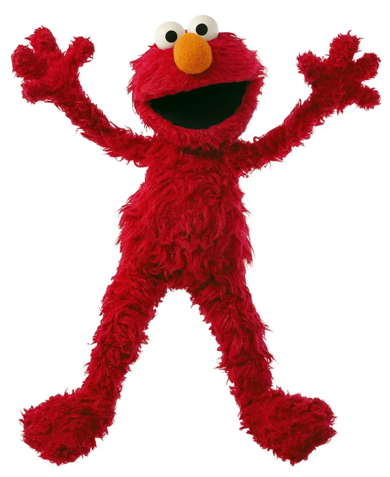{fig-alt="Elmo, personagem da Vila Sésamo"}

[ELMo]{.nome}
[2018 · Allen Institute for AI]{.sub}
Lê a frase da esquerda para a direita e da direita para a esquerda.
:::
::: {.modelo .fragment}
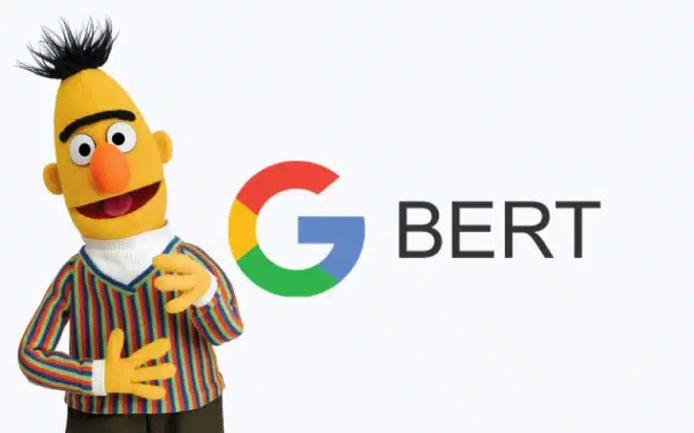{fig-alt="Bert, personagem da Vila Sésamo, ao lado do logotipo do Google"}

[BERT]{.nome}
[2018 · Google]{.sub}
Lê a frase inteira de uma vez, olhando os dois lados de cada palavra.
:::
::: {.modelo .fragment}
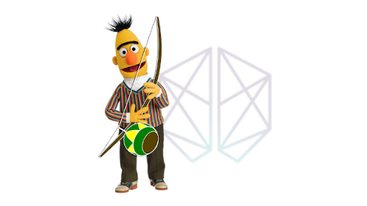{fig-alt="Logotipo do BERTimbau: o Bert tocando berimbau"}

[BERTimbau]{.nome}
[2020 · NeuralMind]{.sub}
O BERT treinado com textos da web brasileira, em português.
:::
:::

::: {.notes}
Depois do word2vec veio uma melhoria importante. No word2vec, cada palavra tem um único ponto no mapa, não importa a frase. Mas "banco" em "sentei no banco da praça" e "banco" em "abri uma conta no banco" são coisas diferentes.

Estes modelos resolvem isso. Eles leem o texto inteiro, que já está todo lá, e fazem as contas para cada palavra olhando as vizinhas. O ponto de "banco" muda conforme a frase: na praça, fica perto de assento; na conta, perto de dinheiro.

[clique] O ELMo, de 2018, do Allen Institute, lê a frase nos dois sentidos.

[clique] O BERT, do Google, também de 2018, lê a frase inteira de uma vez. Os nomes são piada de pesquisador: Elmo e Beto, da Vila Sésamo.

[clique] E o BERTimbau, de 2020, da NeuralMind, aqui do Brasil: o BERT treinado com textos em português.

É aqui que entra o classificador da nossa linha do tempo. O BERT sozinho não decide nada: ele transforma o texto em números que levam o contexto em conta. Em cima desses números, com alguns milhares de exemplos rotulados, se treina o classificador que diz "procedente" ou "improcedente".

A diferença para o ChatGPT é o título do slide. Aqui o texto já está todo lá, e o modelo lê. No GPT o texto ainda não existe, e o modelo escreve, uma palavra de cada vez.
:::

## A diferença dos LLMs: *next token prediction*

```{=html}
<p class="frase-llm">Ante o exposto, considerando as provas do dano sofrido pelo autor, julgo a ação
<span class="lacuna fragment" data-fragment-index="1" data-final="procedente" data-lenta
      data-opcoes="improcedente|parcialmente|prejudicada|extinta"></span>
<span class="sequencia fragment" data-fragment-index="2">
  <span class="lacuna" data-final="para" data-opcoes="e|com|nos|em"></span>
  <span class="lacuna" data-final="condenar" data-opcoes="declarar|determinar|reconhecer|julgar"></span>
  <span class="lacuna" data-final="o" data-opcoes="a|os|ao"></span>
  <span class="lacuna" data-final="réu" data-opcoes="requerido|banco|Estado|autor"></span>
  <span class="lacuna" data-final="ao" data-opcoes="a|no|em"></span>
  <span class="lacuna" data-final="pagamento" data-opcoes="ressarcimento|reembolso|cumprimento"></span>
  <span class="lacuna" data-final="de" data-opcoes="da|do|em"></span>
  <span class="lacuna" data-final="indenização" data-opcoes="multa|valores|quantia|danos"></span>
  <span class="lacuna" data-final="por" data-opcoes="pelos|a|de"></span>
  <span class="lacuna" data-final="danos" data-opcoes="lucros|prejuízos|dano"></span>
  <span class="lacuna" data-final="morais." data-opcoes="materiais|emergentes|causados"></span>
</span>
</p>

<div class="chances fragment" data-fragment-index="3">
  <div class="chances-titulo">Na primeira lacuna, as chances que o modelo calculou (ilustrativo)</div>
  <span>procedente</span><span class="trilho"><span class="barra-p vencedora" style="--w: 97%"></span></span><span>78%</span>
  <span>parcialmente</span><span class="trilho"><span class="barra-p" style="--w: 15%"></span></span><span>12%</span>
  <span>improcedente</span><span class="trilho"><span class="barra-p" style="--w: 9%"></span></span><span>7%</span>
  <span>outras</span><span class="trilho"><span class="barra-p" style="--w: 4%"></span></span><span>3%</span>
</div>

<p class="destaque fragment" data-fragment-index="4">O modelo não leu o processo: leu a frase e escolheu a continuação mais provável.</p>

```

::: {.notes}
Os modelos do slide anterior leem um texto que já existe. O LLM faz outra coisa: ele escreve. E escreve do jeito que a linha do tempo contou, como um classificador que escolhe a próxima palavra.

[clique] "Ante o exposto, considerando as provas do dano sofrido pelo autor, julgo a ação..." Para continuar, o modelo calcula, para cada palavra do vocabulário, a chance de ela vir agora. A roleta é isso: improcedente, parcialmente, prejudicada. E cai na mais provável: procedente.

[clique] E por aí vai. O modelo cola a palavra no fim e pergunta de novo, e de novo, até o ponto final: para condenar o réu ao pagamento de indenização por danos morais. Cada palavra é uma roleta nova. Isso é next token prediction, prever o próximo token. Token é um pedaço de palavra; aqui usei palavras inteiras para simplificar.

[clique] As chances da primeira lacuna. Com o trecho "considerando as provas do dano", procedente fica muito à frente. Tirem esse trecho, deixem só "Ante o exposto, julgo a ação", e a disputa com improcedente fica apertada. O que vem antes muda as chances. Os números são inventados, mas o formato é esse. E, na prática, o modelo nem sempre pega a primeira da lista: ele sorteia entre as mais prováveis, e é por isso que a mesma pergunta pode dar respostas diferentes.

[clique] E o ponto principal. O modelo não leu o processo. Ele leu a frase, e "procedente" é a continuação mais comum depois dela, não a conclusão de quem examinou as provas. Se a gente der o processo a ele, ou seja, o contexto, as chances mudam. É disso que trata o resto da aula.
:::

## Por que ele alucina

```{=html}
<div class="mapa-palavras">
<svg class="mapa-sumulas" viewBox="0 20 680 445" xmlns="http://www.w3.org/2000/svg" role="img"
     aria-label="Mapa com as Súmulas 370, 388 e 403 do STJ e, no meio delas, a Súmula 912, que não existe">
  <!-- Linhas das sumulas de verdade ate o ponto cinza. -->
  <g class="fragment atrasado-roleta" data-fragment-index="2"
     stroke="#94a3b8" stroke-width="2" stroke-dasharray="6 6" fill="none">
    <line x1="140" y1="120" x2="340" y2="240"/>
    <line x1="540" y1="120" x2="340" y2="240"/>
    <line x1="340" y1="380" x2="340" y2="240"/>
  </g>

  <!-- As tres sumulas que existem. -->
  <circle cx="140" cy="120" r="17" fill="#2563eb"/>
  <text x="140" y="86" text-anchor="middle" fill="#2563eb">Súmula 370</text>
  <text class="sub" x="20" y="174">cheque pré-datado</text>
  <text class="sub" x="20" y="196">apresentado antes</text>

  <circle cx="540" cy="120" r="17" fill="#2563eb"/>
  <text x="540" y="86" text-anchor="middle" fill="#2563eb">Súmula 388</text>
  <text class="sub" x="660" y="174" text-anchor="end">devolução indevida</text>
  <text class="sub" x="660" y="196" text-anchor="end">de cheque</text>

  <circle cx="340" cy="380" r="17" fill="#2563eb"/>
  <text x="340" y="424" text-anchor="middle" fill="#2563eb">Súmula 403</text>
  <text class="sub" x="340" y="447" text-anchor="middle">independe de prova do prejuízo</text>

  <!-- Os tres pontos que se juntam, e o ponto cinza onde a resposta cai. -->
  <circle class="fragment converge c-370" data-fragment-index="2" cx="140" cy="120" r="17"
          fill="#9ca3af" fill-opacity="0.5"/>
  <circle class="fragment converge c-388" data-fragment-index="2" cx="540" cy="120" r="17"
          fill="#9ca3af" fill-opacity="0.5"/>
  <circle class="fragment converge c-403" data-fragment-index="2" cx="340" cy="380" r="17"
          fill="#9ca3af" fill-opacity="0.5"/>
  <g class="fragment atrasado-roleta" data-fragment-index="2">
    <circle cx="340" cy="240" r="17" fill="#9ca3af"/>
    <text x="364" y="284" fill="#9ca3af" text-decoration="underline">Súmula 912</text>
  </g>
  <text class="fragment" data-fragment-index="3" x="364" y="308" fill="#dc2626"
        style="font-size: 17px">não existe</text>
</svg>

<div class="conversa">
  <div class="balao fragment" data-fragment-index="1">
    <span class="quem">Pergunta</span>
    Qual súmula do STJ diz que cheque devolvido gera dano moral, sem precisar provar o prejuízo?
  </div>
  <div class="balao balao-resposta fragment" data-fragment-index="2">
    <span class="quem">Resposta</span>
    <span class="frase-llm">É a Súmula
      <span class="lacuna cinza fragment" data-fragment-index="2" data-final="912" data-lenta
            data-opcoes="370|388|403|385|37|227"></span>
      do STJ.</span>
  </div>
  <div class="fragment" data-fragment-index="3">
    <span class="falsa">“A apresentação antecipada ou a devolução indevida de cheque caracteriza dano
    moral, independentemente de prova do prejuízo.”</span>
    <span class="veredito">Não existe: a numeração das súmulas do STJ não chegou a 912.</span>
  </div>
  <div class="destaque fragment" data-fragment-index="4">Cada pedaço existe; o conjunto, não. É o princeso do direito.</div>
</div>
</div>
```

<!-- Sumulas reais do STJ usadas no mapa: 370 ("Caracteriza dano moral a
     apresentacao antecipada de cheque pre-datado"), 388 ("A simples devolucao
     indevida de cheque caracteriza dano moral") e 403 ("Independe de prova do
     prejuizo a indenizacao pela publicacao nao autorizada de imagem de pessoa
     com fins economicos ou comerciais"). A 912 e inventada para o slide. -->

::: {.notes}
Alucinação é o nome que se dá quando o modelo afirma, com toda a segurança, uma coisa que não existe. Não é defeito de um modelo em particular: é consequência do jeito que todos funcionam, que é o que vimos nos últimos slides.

À esquerda, três súmulas do STJ que existem. A 370 diz que apresentar antes da data um cheque pré-datado gera dano moral. A 388, que devolver um cheque indevidamente gera dano moral. A 403 é de outro assunto, uso de imagem, mas tem uma expressão que aparece muito: "independe de prova do prejuízo".

[clique] A pergunta.

[clique] E a resposta, escrita como no slide anterior, uma palavra de cada vez. A roleta passa por números que existem, 370, 388, 403, e para em 912. No mapa, as três súmulas de verdade puxam para o meio, e a resposta cai num ponto cinza. É o mesmo cinza do princeso: um lugar plausível onde não existe nada.

[clique] O texto tem cara de súmula, e o conteúdo até parece certo. Mas não existe: a numeração das súmulas do STJ não chegou a 912. O modelo não consultou nenhuma lista de súmulas. Ele escreveu a continuação mais provável de "É a Súmula", e um número de três algarismos é uma continuação muito provável.

[clique] Cada pedaço existe; o conjunto, não. Isso já custou caro: em 2023, nos Estados Unidos, no caso Mata contra Avianca, dois advogados foram multados em cinco mil dólares por citar numa petição seis precedentes que o ChatGPT tinha inventado.

O remédio não é parar de usar. É conferir, e é dar o contexto: se a súmula verdadeira estiver no texto que você passa ao modelo, ele não precisa inventar. É disso que tratam os próximos slides.
:::

## O que é um token

[Token é o pedaço de texto que o modelo lê e escreve. Cada IA corta de um jeito.]{.intro-token}

```{=html}
<div class="cortes">
<div class="corte fragment" data-fragment-index="1">
  <div class="quem-corta"><b>GPT-5</b><span>OpenAI</span><span class="conta-tokens">27 tokens</span></div>
  <div class="fichas"><span class="ficha f0">Ante</span><span class="ficha f1 esp">o</span><span class="ficha f2 esp">exp</span><span class="ficha f3">osto</span><span class="ficha f4">,</span><span class="ficha f0 esp">jul</span><span class="ficha f1">go</span><span class="ficha f2 esp">proced</span><span class="ficha f3">ente</span><span class="ficha f4 esp">o</span><span class="ficha f0 esp">pedido</span><span class="ficha f1 esp">para</span><span class="ficha f2 esp">conden</span><span class="ficha f3">ar</span><span class="ficha f4 esp">o</span><span class="ficha f0 esp">ré</span><span class="ficha f1">u</span><span class="ficha f2 esp">ao</span><span class="ficha f3 esp">pagamento</span><span class="ficha f4 esp">de</span><span class="ficha f0 esp">inden</span><span class="ficha f1">ização</span><span class="ficha f2 esp">por</span><span class="ficha f3 esp">danos</span><span class="ficha f4 esp">mor</span><span class="ficha f0">ais</span><span class="ficha f1">.</span></div>
</div>
<div class="corte fragment" data-fragment-index="2">
  <div class="quem-corta"><b>Claude*</b><span>Anthropic</span><span class="conta-tokens">33 tokens</span></div>
  <div class="fichas"><span class="ficha f0">Ant</span><span class="ficha f1">e</span><span class="ficha f2 esp">o</span><span class="ficha f3 esp">exp</span><span class="ficha f4">osto</span><span class="ficha f0">,</span><span class="ficha f1 esp">j</span><span class="ficha f2">ul</span><span class="ficha f3">go</span><span class="ficha f4 esp">proced</span><span class="ficha f0">ente</span><span class="ficha f1 esp">o</span><span class="ficha f2 esp">ped</span><span class="ficha f3">ido</span><span class="ficha f4 esp">para</span><span class="ficha f0 esp">conden</span><span class="ficha f1">ar</span><span class="ficha f2 esp">o</span><span class="ficha f3 esp">ré</span><span class="ficha f4">u</span><span class="ficha f0 esp">ao</span><span class="ficha f1 esp">pag</span><span class="ficha f2">amento</span><span class="ficha f3 esp">de</span><span class="ficha f4 esp">ind</span><span class="ficha f0">en</span><span class="ficha f1">ização</span><span class="ficha f2 esp">por</span><span class="ficha f3 esp">dan</span><span class="ficha f4">os</span><span class="ficha f0 esp">mor</span><span class="ficha f1">ais</span><span class="ficha f2">.</span></div>
</div>
<div class="corte fragment" data-fragment-index="3">
  <div class="quem-corta"><b>GPT-4</b><span>OpenAI, versão anterior</span><span class="conta-tokens">31 tokens</span></div>
  <div class="fichas"><span class="ficha f0">Ant</span><span class="ficha f1">e</span><span class="ficha f2 esp">o</span><span class="ficha f3 esp">exp</span><span class="ficha f4">osto</span><span class="ficha f0">,</span><span class="ficha f1 esp">jul</span><span class="ficha f2">go</span><span class="ficha f3 esp">proced</span><span class="ficha f4">ente</span><span class="ficha f0 esp">o</span><span class="ficha f1 esp">pedido</span><span class="ficha f2 esp">para</span><span class="ficha f3 esp">con</span><span class="ficha f4">den</span><span class="ficha f0">ar</span><span class="ficha f1 esp">o</span><span class="ficha f2 esp">ré</span><span class="ficha f3">u</span><span class="ficha f4 esp">ao</span><span class="ficha f0 esp">pagamento</span><span class="ficha f1 esp">de</span><span class="ficha f2 esp">ind</span><span class="ficha f3">en</span><span class="ficha f4">ização</span><span class="ficha f0 esp">por</span><span class="ficha f1 esp">dan</span><span class="ficha f2">os</span><span class="ficha f3 esp">mor</span><span class="ficha f4">ais</span><span class="ficha f0">.</span></div>
</div>
</div>
```

::: {.grade .grade-4 .compacto-tokens .fragment data-fragment-index="4"}
::: {.cartao}
[**O que ele lê e escreve**]{.titulo}
A roleta do slide anterior escolhia tokens, não palavras.
:::
::: {.cartao}
[**O que cabe na conversa**]{.titulo}
O limite do que o modelo enxerga é contado em tokens.
:::
::: {.cartao}
[**O que se paga**]{.titulo}
O preço é por milhão de tokens, de entrada e de saída.
:::
::: {.cartao}
[**Português custa mais**]{.titulo}
A mesma frase em inglês, com os mesmos 107 caracteres, dá 21 tokens no GPT-5.
:::
:::

::: {.fonte}
Contagens de 3/10/2026 em platform.openai.com/tokenizer e lunary.ai/anthropic-tokenizer. \*A Anthropic só publicou o tokenizador de modelos antigos do Claude; o dos atuais se consulta pela API de contagem de tokens.
:::

<!-- Frase em ingles usada na comparacao: "In light of the foregoing, I grant
     the claim and order the defendant to pay compensation for moral damages."
     107 caracteres, 21 tokens no GPT-5, uma palavra por token. -->

::: {.notes}
O modelo não lê letras, nem palavras inteiras. Ele lê pedaços, que se chamam tokens. Palavra comum vira um pedaço só; palavra menos comum é quebrada em dois ou três.

[clique] A frase do slide anterior, cortada pelo tokenizador do GPT-5: 27 tokens. "Pedido", "pagamento" e "danos" ficaram inteiros. "Indenização" virou dois pedaços, e "condenar" também.

[clique] A mesma frase no Claude: 33 tokens. "Pedido" virou "ped" e "ido"; "pagamento" virou "pag" e "amento". Cada empresa treina o seu próprio cortador, com os textos que escolheu, e por isso os cortes não batem. Uma ressalva honesta: a Anthropic só publicou o cortador dos modelos antigos do Claude, e é esse que o site mostra. Para os modelos atuais, a contagem exata vem de uma consulta à API deles.

[clique] E até a mesma empresa muda de uma geração para outra: o GPT-4 cortava a mesma frase em 31.

[clique] Por que isso importa. Primeiro, é a unidade do próprio modelo: a roleta do slide anterior não escolhia palavras, escolhia tokens. Segundo, o tamanho da conversa, o quanto o modelo consegue enxergar de uma vez, é medido em tokens; é o assunto do próximo slide. Terceiro, é o que se paga: quem usa pela API paga por milhão de tokens, os que entram e os que saem, e os limites de uso dos planos também são contados assim.

E o português sai mais caro. A mesma frase em inglês tem exatamente os mesmos 107 caracteres e dá 21 tokens no GPT-5, porque em inglês quase toda palavra é um token só. Em português, 27. Os cortadores aprenderam com muito mais texto em inglês.
:::

## O que o modelo vê: a janela de contexto

```{=html}
<div class="janela-grade">
<div class="janela-demo">
  <div class="fita">
    <div class="msg m1"><span class="n-msg">1</span><span class="txt">O autor tem 15 anos.</span><span class="fora">fora da janela</span></div>
    <div class="msg m2 fragment" data-fragment-index="1"><span class="n-msg">2</span>Comprou um celular pela internet. Chegou quebrado.</div>
    <div class="msg m3 fragment" data-fragment-index="2"><span class="n-msg">3</span>A loja se recusou a trocar.</div>
    <div class="msg m4 fragment" data-fragment-index="3"><span class="n-msg">4</span>Ele quer processar a loja por danos morais.</div>
    <div class="moldura">
      <span class="rotulo-janela">o que o modelo vê:
        <span class="cont c1">8</span><span class="cont c2">19</span><span class="cont c3">29</span><span class="cont c4">31</span>
        de 32 tokens</span>
    </div>
  </div>
  <div class="legenda-janela">Limite de 32 tokens, para caber no slide. Os modelos de hoje aguentam centenas de milhares.</div>
</div>

<div class="conversa">
  <div class="balao">
    <span class="quem">A cada mensagem nova, a mesma pergunta</span>
    Ele pode assinar sozinho a procuração para o advogado?
  </div>
  <div class="respostas">
    <div class="balao balao-certa fragment fade-out" data-fragment-index="3">
      <span class="quem">Resposta</span>
      Não. Ele tem 15 anos: precisa ser representado pelos pais.
    </div>
    <div class="balao balao-errada fragment" data-fragment-index="3">
      <span class="quem">Resposta</span>
      Sim. Ele pode assinar a procuração e entrar com a ação.
    </div>
  </div>
  <div class="placar">
    <span class="acerto">✓</span>
    <span class="acerto fragment" data-fragment-index="1">✓</span>
    <span class="acerto fragment" data-fragment-index="2">✓</span>
    <span class="erro-x fragment" data-fragment-index="3">✗</span>
  </div>
  <div class="destaque fragment" data-fragment-index="4">Fora da janela, não existe. E o modelo não avisa que esqueceu.</div>
</div>
</div>

<div class="janela-grade resumo-grade">
<div class="resumo-demo">
  <div class="resumo-titulo fragment" data-fragment-index="5">E se, em vez de cortar, o programa resumir a conversa?</div>
  <div class="janela-box fragment" data-fragment-index="5">
    <span class="rotulo-box">o que o modelo vê</span>
    <span class="rotulo-box cheia">janela cheia</span>
    <div class="pilulas">
      <span class="pilula p-idade">1 · 15 anos</span>
      <span class="pilula p-abs">2 · celular quebrado</span>
      <span class="pilula p-abs">3 · loja recusou a troca</span>
      <span class="pilula p-abs">4 · danos morais</span>
      <span class="pilula p-abs">5 · tem nota fiscal</span>
    </div>
    <div class="resumo-texto">
      <span class="pilula p-resumo">Resumo</span>
      O consumidor comprou um celular pela internet, que chegou quebrado, e a loja recusou a troca.
      Tem nota fiscal e quer processar por danos morais.
      <span class="pilula p-nova">6 · qual é o prazo para processar?</span>
    </div>
  </div>
  <div class="fora-da-box">
    <span class="r-entra6 fragment fade-in-then-out" data-fragment-index="6">
      <span class="pilula p-nova">6 · qual é o prazo para processar?</span>
      <span class="aviso-fora">não cabe</span>
    </span>
    <span class="r-resumo fragment" data-fragment-index="7">
      <span class="pilula p-caiu">1 · 15 anos</span>
      <span class="aviso-fora">ficou de fora do resumo</span>
    </span>
  </div>
</div>

<div class="conversa">
  <div class="respostas">
    <div class="fragment" data-fragment-index="5">
      <div class="balao balao-certa fragment fade-out" data-fragment-index="8">
        <span class="quem">Resposta, com as mensagens de 1 a 5</span>
        Não. Ele tem 15 anos: precisa ser representado pelos pais.
      </div>
    </div>
    <div class="balao balao-errada fragment" data-fragment-index="8">
      <span class="quem">Resposta, lendo o resumo</span>
      Sim. Ele pode assinar a procuração e entrar com a ação.
    </div>
  </div>
  <div class="placar">
    <span class="acerto fragment" data-fragment-index="5">✓</span>
    <span class="erro-x fragment" data-fragment-index="8">✗</span>
  </div>
  <div class="destaque fragment" data-fragment-index="9">Quem resume decide o que é detalhe.</div>
</div>
</div>
```

<!-- Contagens de tokens ilustrativas, escolhidas para a conta fechar: 8, 11,
     10 e 10 por mensagem. Com a quarta, seriam 39 de 32; sem a primeira, 31.
     A resposta certa segue o art. 3o do Codigo Civil: menor de 16 anos e
     absolutamente incapaz e precisa ser representado. -->

::: {.notes}
Todo modelo tem um limite de quanto texto enxerga de uma vez, contado em tokens: é a janela de contexto. Para caber no slide, aqui o limite é de 32 tokens. Nos modelos de hoje são centenas de milhares, o que dá um livro inteiro. Mas uma conversa longa, com petição, contrato e acórdão colados, enche.

A conversa começa com a informação que decide o caso: o autor tem 15 anos. E a cada mensagem nova eu faço a mesma pergunta: ele pode assinar sozinho a procuração? Com 15 anos, não: é absolutamente incapaz e precisa ser representado.

[clique] Segunda mensagem. A janela cresce, ainda cabe tudo, e o modelo acerta.

[clique] Terceira. A janela está quase cheia, 29 de 32, e o modelo ainda acerta.

[clique] Quarta mensagem. Não cabe mais. A janela anda para a frente e a primeira mensagem, justamente a da idade, fica para fora. E a resposta vira "sim".

[clique] O pior é isto: o modelo não avisa que esqueceu. Ele responde com a mesma segurança de antes.

Um detalhe técnico: quem decide o que sai não é o modelo, é o programa de chat em volta dele. Uns cortam as mensagens mais antigas, como acabamos de ver. Outros simplesmente avisam que a conversa ficou longa demais. E muitos, hoje, fazem outra coisa.

[clique] Em vez de cortar, resumem a conversa antiga. Vamos ver a mesma conversa, agora com cinco mensagens dentro da janela. Mesma pergunta, e a resposta vem certa e completa: não, ele tem 15 anos, precisa ser representado.

[clique] Chega a sexta mensagem, perguntando o prazo para processar. Não cabe: a janela está cheia.

[clique] Em vez de cortar a primeira, o programa resume as cinco. O resumo é bom: tem o celular, a loja, a recusa, a nota fiscal, os danos morais. E a sexta mensagem entra. Só que a idade não entrou no resumo. Para quem resumiu, era um detalhe.

[clique] E a resposta erra do mesmo jeito que no corte.

[clique] Quem resume decide o que é detalhe. E quem resume, muitas vezes, é outro modelo, que não sabe que a pergunta vai ser sobre capacidade civil. E, mesmo dentro da janela, conversa muito comprida piora: uma pesquisa de 2023 mostrou que os modelos prestam menos atenção no que fica no meio de um texto longo.

Daí três hábitos. Repetir o essencial no pedido. Começar uma conversa nova quando o assunto muda. E colocar os fatos que decidem o caso logo no pedido, não lá atrás na conversa.
:::

## Código é texto, e texto previsível

::: {.grade .grade-2 .compacto-codigo}
::: {.cartao .fragment data-fragment-index="1"}
[**Código é texto**]{.titulo}
Para o modelo, Python é texto cortado em tokens, como uma petição. Foi o primeiro argumento do Encontro 1.
:::
::: {.cartao .fragment data-fragment-index="2"}
[**Mais previsível que o português**]{.titulo}
Poucas palavras, regras rígidas e milhões de exemplos parecidos na internet. Cada lacuna tem duas ou três saídas.
:::
:::

```{=html}
<div class="slide-codigo fragment" data-fragment-index="3">
<pre class="frase-llm codigo-llm"><span class="com"># média da condenação por setor, em processos.csv</span>
import pandas as <span class="lacuna fragment" data-fragment-index="3" data-final="pd" data-opcoes="pandas|np" data-voltas="8" data-atraso="70" data-pausa="300"></span><span class="sequencia fragment" data-fragment-index="4"><span class="lacuna" data-final="&#10;df" data-opcoes="&#10;dados|&#10;processos" data-voltas="5" data-atraso="60" data-pausa="300"></span><span class="lacuna" data-final=" = " data-opcoes=" == " data-voltas="5" data-atraso="60" data-pausa="300"></span><span class="lacuna" data-final="pd" data-opcoes="pandas" data-voltas="5" data-atraso="60" data-pausa="300"></span><span class="lacuna" data-final=".read_csv" data-opcoes=".read_excel|.read_table" data-voltas="5" data-atraso="60" data-pausa="300"></span><span class="lacuna" data-final="(&quot;processos.csv&quot;)" data-opcoes="(&quot;dados.csv&quot;)|(&quot;processos.xlsx&quot;)" data-voltas="5" data-atraso="60" data-pausa="300"></span></span><span class="sequencia fragment" data-fragment-index="5"><span class="lacuna" data-final="&#10;df" data-opcoes="&#10;media = df|&#10;print(df" data-voltas="5" data-atraso="60" data-pausa="300"></span><span class="lacuna" data-final=".groupby" data-opcoes=".query|.sort_values" data-voltas="5" data-atraso="60" data-pausa="300"></span><span class="lacuna" data-final="(&quot;setor&quot;)" data-opcoes="(&quot;Setor&quot;)|([&quot;setor&quot;])" data-voltas="5" data-atraso="60" data-pausa="300"></span><span class="lacuna duvida" data-final="[&quot;valor_condenacao&quot;]" data-opcoes="[&quot;condenacao&quot;]|[&quot;valor&quot;]" data-voltas="5" data-atraso="60" data-pausa="300"></span><span class="lacuna" data-final=".mean()" data-opcoes=".median()|.sum()" data-voltas="5" data-atraso="60" data-pausa="300"></span></span></pre>
<div class="opcoes-token">
  <span class="rotulo-opcoes">opções para o próximo token:</span>
  <span class="lista-opcoes"></span>
</div>
</div>

<p class="destaque fragment" data-fragment-index="6">Por isso a IA escreve pandas tão bem. O que ela mais chuta é o que só você sabe: o nome da coluna.</p>

<script>
// Mostra, embaixo do codigo, as opcoes do token que a roleta esta escrevendo.
// Escuta o evento "roleta" que o script geral dispara a cada giro. No ultimo
// clique, a barra passa a mostrar as opcoes do nome da coluna (.duvida).
(function () {
  function desenhar(secao, el, escolhida, rotulo) {
    var lista = secao.querySelector(".opcoes-token .lista-opcoes");
    secao.querySelector(".opcoes-token .rotulo-opcoes").textContent = rotulo;
    lista.textContent = "";
    if (!el) return;
    [el.dataset.final].concat(el.dataset.opcoes.split("|")).forEach(function (o) {
      var ficha = document.createElement("span");
      ficha.className = "ficha-opcao";
      if (escolhida && o === el.dataset.final) ficha.classList.add("escolhida");
      ficha.textContent = o.replace(/\n/g, "").trim();
      lista.appendChild(ficha);
    });
  }
  function duvidaAtiva(secao) {
    var d = secao.querySelector(".slide-codigo + .destaque");
    return d && d.classList.contains("visible");
  }
  document.addEventListener("roleta", function (e) {
    var secao = e.target.closest("section");
    if (!secao || !secao.querySelector(".opcoes-token")) return;
    if (duvidaAtiva(secao)) {
      desenhar(secao, secao.querySelector(".lacuna.duvida"), true, "opções para o nome da coluna:");
    } else {
      desenhar(secao, e.detail.lacuna, e.detail.estado !== "gira", "opções para o próximo token:");
    }
  });
  window.addEventListener("load", function () {
    function trocar(e) {
      var secao = (e.fragment || {}).closest && e.fragment.closest("section");
      if (!secao || !secao.querySelector(".opcoes-token")) return;
      if (duvidaAtiva(secao)) {
        desenhar(secao, secao.querySelector(".lacuna.duvida"), true, "opções para o nome da coluna:");
      } else {
        var prontas = secao.querySelectorAll(".codigo-llm .lacuna.pousou");
        desenhar(secao, prontas[prontas.length - 1] || null, true, "opções para o próximo token:");
      }
    }
    Reveal.on("fragmentshown", trocar);
    Reveal.on("fragmenthidden", trocar);
  });
})();
</script>
```

::: {.notes}
Duas ideias e uma demonstração.

[clique] Primeira: código é texto. Foi o primeiro argumento do Encontro 1, e vale para a IA também. O modelo que escreve petição é o mesmo que escreve Python; para ele, os dois são tokens.

[clique] Segunda: código é mais previsível que o português. Uma linguagem de programação tem poucas palavras, regras rígidas, e milhões de exemplos parecidos publicados. Uma pesquisa de 2012, chamada "On the Naturalness of Software", mostrou isso com números: código é mais repetitivo e mais fácil de prever do que a língua escrita.

[clique] A roleta de novo, agora escrevendo Python. Depois de "import pandas as", olhem a barra embaixo: três opções, e uma domina. É "pd" praticamente sempre.

[clique] A segunda linha. df, igual, pd, read_csv, o nome do arquivo. Em cada token, duas ou três saídas. Na sentença do slide anterior, a roleta tinha dezenas de continuações plausíveis.

[clique] A terceira. groupby, a coluna do grupo, a coluna do valor, a média.

[clique] Por isso a IA escreve pandas tão bem: há poucas saídas, e ela já viu milhões de exemplos. Mas reparem no token marcado. "valor_condenacao", "condenacao" ou "valor": é o nome da coluna, e isso só a sua tabela sabe. É aí que vem o KeyError do Encontro 4. E previsível não quer dizer certo: o df.append também era uma continuação muito provável, e saiu do pandas na versão 2.0.

Uma última coisa: a primeira linha, o comentário, é o contexto. Foi ele que disse o nome do arquivo e o assunto. Sem ele, esses nomes seriam chute total. É o assunto da próxima parte da aula.
:::

# Exemplos práticos no Notebook! {.secao background-color="#023A78"}

Abram o notebook do Encontro 6 no Colab e salvem uma cópia no Drive. Em cada célula vazia, peçam ao Gemini o que está escrito, do jeito que está escrito.

::: {.notes}
Agora vocês vão pedir código ao Gemini, dentro do Colab. Os pedidos do notebook são vagos de propósito: é assim que a gente pede no dia a dia.

Antes de rodar cada célula, leiam o código que veio. Depois de rodar, a gente confere junto, na tela. Pergunto "quanto deu para vocês?" antes de mostrar o certo: para o mesmo pedido, cada um vai ter um resultado.

O roteiro de cada exercício, o resultado certo e o que mostrar na tela estão no gabarito do professor.
:::

# Do notebook para o agente {.secao background-color="#023A78"}

No VS Code, com o Claude Code: o `analise.py` que saiu do Colab vira o `analise_2.py`, com tabelas e seis gráficos.

::: {.notes}
Demonstração minha. O agente lê os arquivos da pasta, roda o código no meu computador e pede permissão antes de cada ação. Os pedidos e o que saiu de cada um estão nos próximos slides.
:::

## O ponto de partida

::: {.print-tela .print-grande}
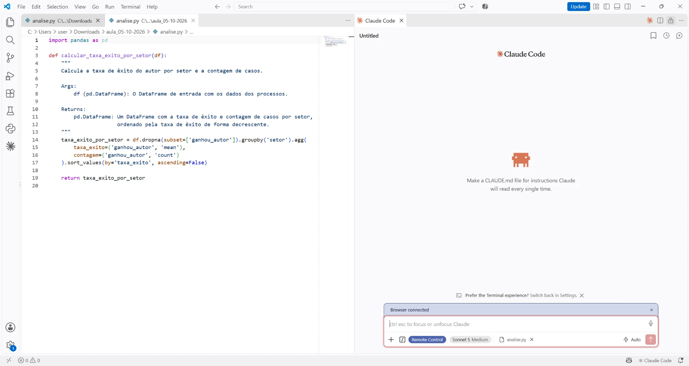{fig-alt="VS Code com o analise.py à esquerda e o painel do Claude Code vazio à direita"}
:::

::: {.legenda-print}
À esquerda, o `analise.py` que saiu do Colab. À direita, o Claude Code. O pedido, o mais humano possível, vai ser feito três vezes, mudando só o que o agente consegue ver: [**"Melhora esse analise.py"**]{.pedido}
:::

::: {.notes}
Esse é o arquivo que vocês baixaram do Colab, aberto no VS Code. Ao lado, o Claude Code, o agente que lê os arquivos da pasta e roda código no meu computador, pedindo permissão antes.

Eu vou fazer o pedido mais vago possível, do jeito que a gente faz no dia a dia: "melhora esse analise.py". E vou repetir o mesmo pedido três vezes. A única coisa que muda é o que o agente consegue ver.
:::

## Tentativa 1: só o código

::: {.print-tela .print-grande}
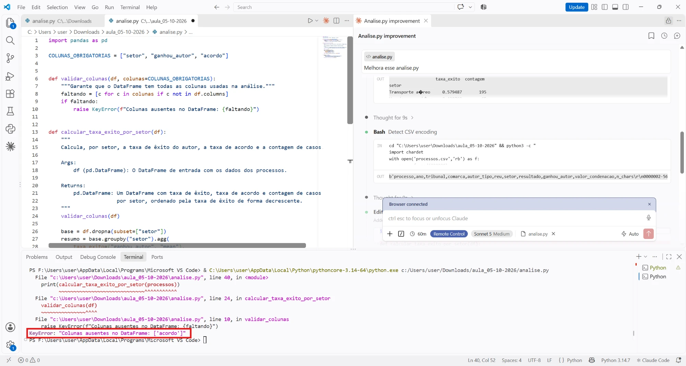{fig-alt="VS Code com o analise.py melhorado pelo Claude Code e, no terminal, o erro KeyError: Colunas ausentes no DataFrame: ['acordo']"}
:::

::: {.legenda-print}
O código voltou com validação de colunas, docstring e uma taxa de acordo nova. Na primeira vez que rodou com a base de verdade, parou no terminal: [**`KeyError: "Colunas ausentes no DataFrame: ['acordo']"`**]{.pedido}
:::

::: {.notes}
Primeira tentativa: o agente via só o analise.py, sem a base. Pedi "melhora esse analise.py" e ele devolveu um código com cara de profissional: uma função que confere as colunas, docstring em português, e uma taxa de acordo que eu nem pedi.

Olhem o terminal, embaixo: rodei com a base de verdade e ele parou na hora. A coluna acordo não existe. O próximo slide mostra por quê.
:::

## Tentativa 1: só o código

```
KeyError: "Colunas ausentes no DataFrame: ['acordo']"
```

::: {.grade .grade-3 .compacto-git .tentativa}
::: {.cartao .fragment}
[**Supôs uma coluna**]{.titulo}
Calculou a taxa de acordo a partir de uma coluna `acordo`, que não existe na base. Quebra na primeira execução.
:::
::: {.cartao .fragment}
[**Escondeu setores sem avisar**]{.titulo}
Um mínimo de 30 casos tira plano de saúde e seguros do êxito, e 7 dos 12 setores das condenações.
:::
::: {.cartao .fragment}
[**Escolheu o método por você**]{.titulo}
Ordenou as condenações pela soma, que mede volume, e não valor.
:::
:::

[O código parece pronto, com documentação e validação. E quebra com a base de verdade.]{.destaque .fragment}

::: {.notes}
O que deu errado nessa primeira tentativa, sem a base para olhar.

[clique] Ele supôs uma coluna acordo, que não existe: na base só tem resultado. É o erro do Encontro 4, a coluna que ela supôs, agora num código com cara de profissional.

[clique] Ele colocou um mínimo de 30 casos, o que é uma boa ideia, mas sem avisar: plano de saúde e seguros sumiram da taxa de êxito, e sete dos doze setores sumiram das condenações.

[clique] E ordenou as condenações pela soma. Banco e financeira ficou no topo só porque tem mais processos.

[clique] O agente erra com mais elegância que o chat. Por isso a regra continua: rodar e conferir com um número que a gente conhece.
:::

## Tentativa 2: anexar as bases

::: {.print-tela .print-grande}
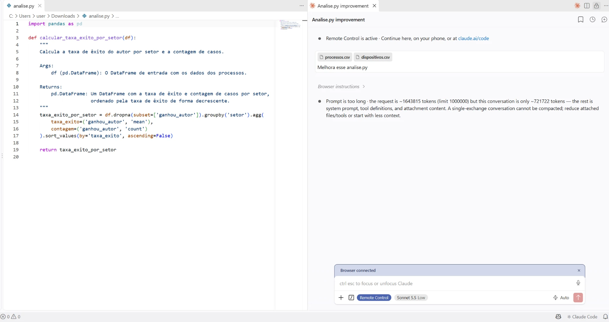{fig-alt="Claude Code com processos.csv e dispositivos.csv anexados e o aviso Prompt is too long"}
:::

::: {.legenda-print}
[**1,6 milhão de tokens**]{.numero-medio}, para um limite de 1 milhão: o pedido nem foi respondido. As duas planilhas são quase todas texto de sentença; anexadas, elas entram inteiras no pedido e não cabem na janela de contexto. [Mais contexto não é melhor contexto.]{.destaque .fragment}
:::

::: {.notes}
Segunda tentativa: anexei as duas bases ao pedido. Parece o mais justo, dar os dados ao agente.

Olhem o aviso: o pedido tinha cerca de 1,6 milhão de tokens, e o limite é de 1 milhão. Ele nem respondeu. As duas planilhas somam uns 3 megabytes, quase todos de texto de sentença, e anexar coloca o arquivo inteiro dentro do pedido.

É o slide do token e o da janela de contexto juntos: mesmo uma janela enorme não comporta duas planilhas de uma pesquisa pequena.

[clique] Colar tudo é o contrário de engenharia de contexto. O certo é entregar o que o modelo precisa.
:::

## Tentativa 3: as bases na pasta

[As bases ficam na pasta, e o agente abre só o que precisa. O pedido seguinte, vago de novo: *"faça gráficos importantes"*.]{.legenda-print}

::: {.graficos-duplo style="--alt: 430px"}
::: {.fragment}
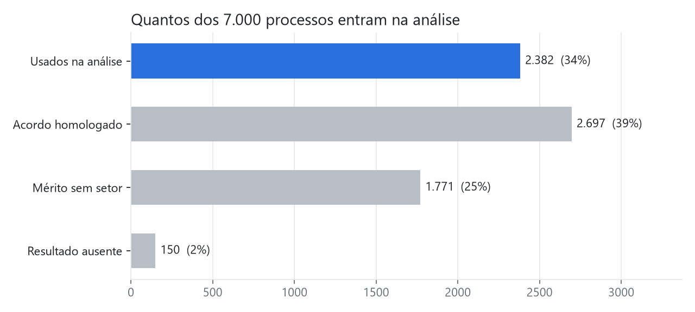{fig-alt="Barras: dos 7.000 processos, 2.382 entram na análise"}
:::
::: {.fragment}
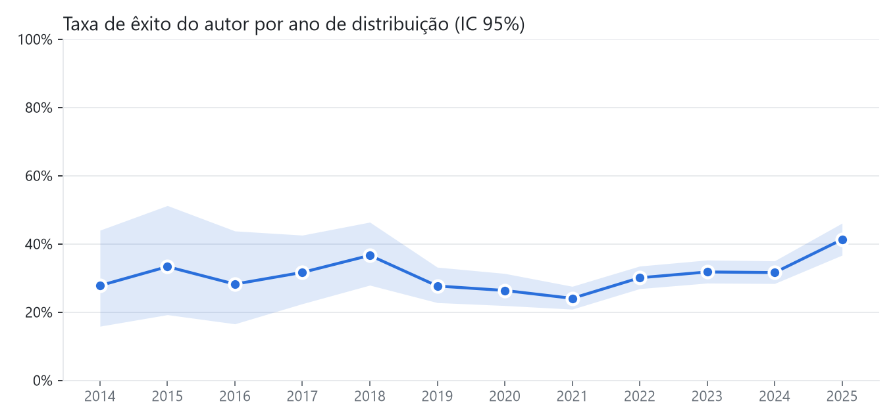{fig-alt="Taxa de êxito do autor por ano, com intervalo de confiança"}
:::
::: {.grande .fragment}
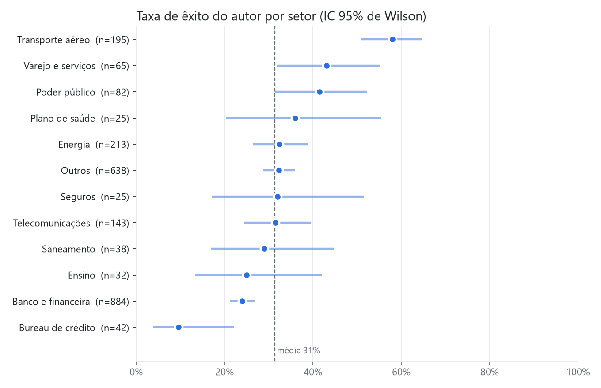{fig-alt="Taxa de êxito por setor com intervalo de confiança"}
:::
:::

[Ninguém pediu o primeiro gráfico: só 34% dos 7.000 processos entram na conta.]{.destaque .fragment}

[Vocês entendem o gráfico de Taxa de êxito? Quem é Wilson?]{.pergunta-vermelha .fragment}

::: {.notes}
Terceira tentativa: as bases na pasta, sem anexar. É a diferença entre um chat e um agente. No chat, você cola tudo. O agente vai buscar: abre o arquivo com um comando e lê só o cabeçalho, umas linhas, os valores de uma coluna.

E eu fui vago de novo, de propósito: "faça gráficos importantes".

[clique] O primeiro gráfico ninguém pediu. Dos 7.000 processos, quantos entram na análise? Só 2.382. Os outros são acordos, sentenças sem resultado, ou processos sem setor identificado. É o nosso hábito de dizer em quantos casos cada número se baseia, e ele fez sozinho.

[clique] O segundo, embaixo, a taxa de êxito ano a ano, com a faixa do intervalo de confiança.

[clique] O terceiro, o grande, põe um intervalo de confiança em cada setor. Reparem em plano de saúde e seguros, com 25 casos cada: a linha é enorme. É o jeito visual de dizer "esse número diz pouco".

[clique] Com o contexto certo, até o pedido vago saiu bom. Conferi os números contra a base: batem todos.

[clique] A pergunta é para eles: alguém sabe ler o gráfico grande? Quem é Wilson? Se ninguém souber, é a deixa: o agente pôs no gráfico algo que talvez nem quem pediu saiba explicar.

Como ler: o ponto é a taxa de êxito do setor; a linha é o intervalo de confiança de 95%, a faixa em que a taxa "verdadeira" provavelmente está. Quanto menos casos, mais larga a linha. Plano de saúde tem 36%, mas com 25 casos a linha vai de 20% a 56%. A linha tracejada é a taxa geral, 31%. Se a linha de um setor cruza a tracejada, não dá para dizer que ele é diferente da média. Transporte aéreo (51% a 65%) fica todo acima; banco e financeira (21% a 27%), todo abaixo.

Wilson é Edwin B. Wilson, estatístico americano, que propôs esse jeito de calcular o intervalo de uma proporção em 1927. A conta mais simples, a taxa mais ou menos uma margem, erra quando há poucos casos ou quando a taxa é perto de 0% ou de 100%, e pode até dar intervalo abaixo de zero. O de Wilson não sai de 0% a 100%. Por isso Bureau de crédito, com 10%, tem a linha de 4% a 22%, sem passar do zero.
:::

## Gráficos específicos

::: {.legenda-print}
> Faça três gráficos: barras da taxa de êxito por setor, resultados por ano em barras empilhadas e um gráfico de dispersão de acordo contra êxito por setor.
:::

::: {.graficos-duplo style="--alt: 465px"}
::: {.fragment}
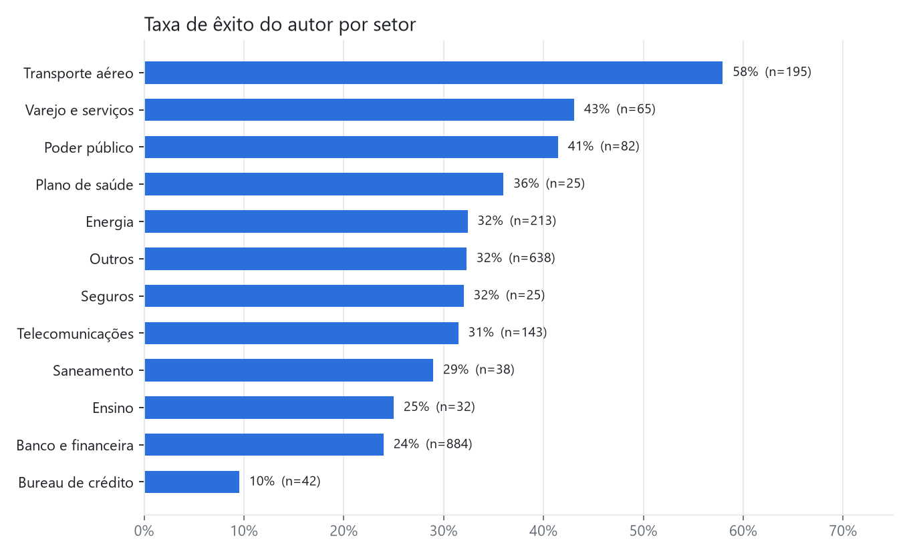{fig-alt="Barras da taxa de êxito do autor por setor"}
:::
::: {.fragment}
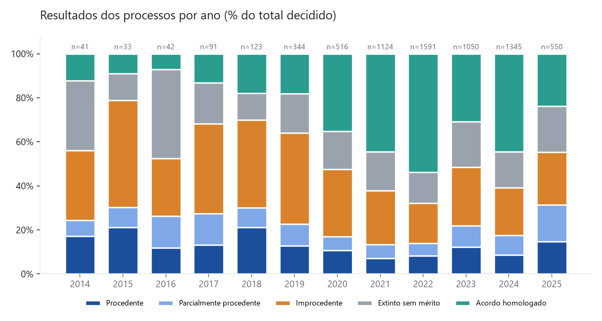{fig-alt="Barras empilhadas com os resultados dos processos por ano"}
:::
::: {.grande .fragment}
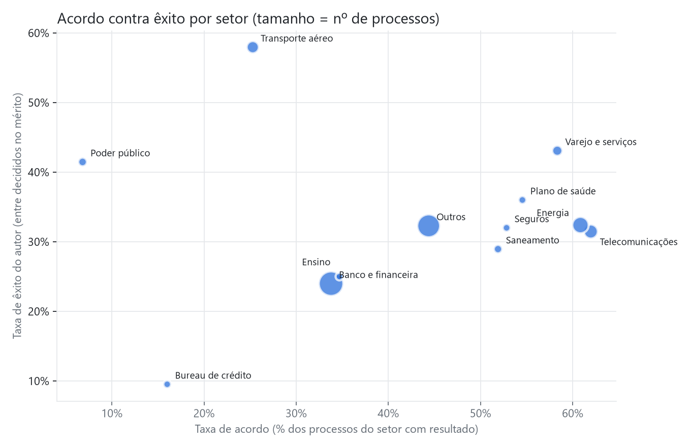{fig-alt="Dispersão da taxa de acordo contra a taxa de êxito por setor"}
:::
:::

::: {.notes}
E agora o pedido específico, com os três gráficos que eu queria.

[clique] As barras da taxa de êxito, com o número de casos ao lado de cada uma.

[clique] Os resultados ano a ano. Reparem nas cores: os azuis são quando o autor ganha, o laranja é improcedente, o cinza é extinto e o verde é acordo. Ninguém pediu essas cores; ele escolheu cores com significado.

[clique] E acordo contra êxito, um ponto por setor. Transporte aéreo lá em cima, com muito êxito e pouco acordo; energia e telecomunicações à direita, com muito acordo.
:::

## Mesma instrução, três resultados

::: {.columns}
::: {.column width="56%"}
| O que o agente via | O que aconteceu |
|:--|:--|
| Só o `analise.py` | Inventou a coluna `acordo` e quebrou |
| As bases anexadas | 1,6 milhão de tokens: não coube na janela |
| As bases na pasta | Acertou os números e ainda mostrou quantos casos entram |
:::
::: {.column width="44%"}
[**E ainda vale conferir**]{.titulo}

- Ele sobrescreveu o `analise.py`, em vez de criar um novo.
- A fonte do gráfico só existe no Windows.
- Os rótulos da dispersão foram posicionados à mão, para esta base.
- A linha de "média" usa só os processos com setor. Média de quê?
:::
:::

[Contexto certo, não contexto máximo. E conferir continua sendo seu.]{.destaque .fragment}

::: {.notes}
Resumindo: o mesmo pedido, três resultados, e o que mudou foi só o que o agente via.

Sem os dados, ele supôs. Com os dados anexados, não coube. Com os dados na pasta, ele foi buscar só o que precisava e acertou.

E mesmo a melhor versão tem o que conferir. Ele sobrescreveu o arquivo original, em vez de criar o analise_2. Escolheu uma fonte que só existe no Windows. Posicionou os rótulos à mão, então com outra base eles podem se encavalar. E a "média" do gráfico usa só os processos com setor.

[clique] A lição é a mesma do Colab, um degrau acima: contexto certo, e não contexto máximo. E a conferência continua sendo nossa.
:::

# E se viesse tudo organizado? {.secao background-color="#023A78"}

::: {.notes}
Até aqui, o agente ou adivinhava, ou recebia coisa demais. E se ele recebesse tudo organizado numa pasta: os dados, o código e um arquivo explicando as regras? É isso que um repositório é.
:::

# O Codex e um repositório {.secao background-color="#023A78"}

Deem o seguinte prompt em uma janela do Codex:

> Clone https://github.com/lab-dados/programacao-aplicada-ao-direito_clone. O sandbox bloqueia a rede, então me pergunte expressamente se pode clonar ou não, e em que pasta deverá salvar.

Iremos entender melhor esse comando mais adiante! Enquanto aguardamos o clone, vamos entender o GitHub!

::: {.notes}
O repositório traz as duas bases, o analise_2.py, o index.html e o AGENTS.md. O AGENTS.md é o contexto que o Codex lê antes de qualquer pedido, e cada regra dele saiu de um erro que vimos no Colab. O "clone" volta no slide dos verbos do Git.

Por que o prompt fala do sandbox: o Codex roda os comandos com a rede desligada. Sem esse aviso, o clone falha com um erro chamado SEC_E_NO_CREDENTIALS, e o Codex conclui, errado, que falta login no GitHub. O repositório é público, não precisa de login. Com o aviso, ele pede permissão para sair do sandbox, e cada um aprova. Vale mostrar: o agente pede licença antes de acessar a internet, e o erro que ele explica nem sempre é o erro real.
:::

## O que é o GitHub?

::: {.columns}
::: {.column width="36%"}
::: {.logo-github}
{fig-alt="Logotipo do GitHub" style="width: 80px; min-width: 80px; height: 80px;"}

[Ajuda a pensar como um Google Drive para programadores.]{.destaque}
:::

::: {.cartao .cartao-github}
[**Git e GitHub não são a mesma coisa**]{.titulo}

O **Git** é o programa que guarda o histórico do seu projeto, no seu computador: cada versão, quem mudou, quando e por quê.

O **GitHub** é o site que guarda uma cópia desse projeto na internet, para compartilhar, trabalhar junto e publicar páginas.
:::
:::
::: {.column width="64%"}
[**Glossário**]{.titulo}

::: {.grade .grade-2 .compacto-git}
::: {.cartao}
[**Repositório**]{.titulo}
A pasta do projeto, com todo o histórico dentro. "Repo", para os íntimos.
:::
::: {.cartao}
[**Commit**]{.titulo}
Uma fotografia das mudanças, com uma mensagem dizendo o que mudou.
:::
::: {.cartao}
[**Branch**]{.titulo}
Uma linha de trabalho paralela. A principal se chama `main`.
:::
::: {.cartao}
[**Remote (`origin`)**]{.titulo}
A cópia do repositório que está no GitHub.
:::
::: {.cartao}
[**Fork**]{.titulo}
Uma cópia de um repositório alheio, na sua conta do GitHub.
:::
::: {.cartao}
[**GitHub Pages**]{.titulo}
Transforma um repositório num site, de graça. É onde a análise vai morar.
:::
:::
:::
:::

::: {.notes}
Duas coisas que todo mundo confunde. Git é um programa, que vocês instalaram no Encontro 1: ele roda no computador de vocês e guarda o histórico do projeto. GitHub é um site, de uma empresa, que guarda uma cópia desse histórico na internet. Dá para usar Git sem GitHub; o contrário, não.

O glossário é o mínimo para hoje. Repositório é a pasta com o histórico. Commit é uma fotografia das mudanças, com uma mensagem. Branch é uma linha de trabalho paralela; a principal é a main. Remote, que costuma se chamar origin, é a cópia no GitHub. Fork é a sua cópia de um repositório de outra pessoa. E o GitHub Pages transforma um repositório num site: é o que vamos usar para publicar a análise.
:::

## Os verbos do Git

::: {.grade .grade-5 .compacto-git .verbos-git}
::: {.cartao .fragment}
[1]{.numero}
[**clone**]{.titulo}
`git clone <endereço>`

Baixa uma cópia do repositório, com todo o histórico. Faz uma vez só.
:::
::: {.cartao .fragment}
[2]{.numero}
[**pull**]{.titulo}
`git pull`

Traz para o seu computador o que mudou no GitHub desde a última vez.
:::
::: {.cartao .fragment}
[3]{.numero}
[**commit**]{.titulo}
`git add .`<br>`git commit -m "..."`

Fotografa as suas mudanças, com uma mensagem. Fica só no seu computador.
:::
::: {.cartao .fragment}
[4]{.numero}
[**push**]{.titulo}
`git push`

Envia os seus commits para o GitHub. Só aí os outros veem.
:::
::: {.cartao .fragment}
[5]{.numero}
[**rebase**]{.titulo}
`git pull --rebase`

Põe os seus commits em cima da versão mais nova, em linha reta. Reescreve o histórico: só em commits que ainda não subiram.
:::
:::

[Clone uma vez; depois, todo dia: pull, trabalhe, commit, push.]{.destaque .fragment}

::: {.notes}
Cinco verbos, na ordem em que aparecem.

[clique] Clone: baixa o repositório inteiro, com o histórico. Foi o que vocês fizeram com o repositório do Codex. Faz uma vez só.

[clique] Pull: traz o que mudou no GitHub. Antes de começar a trabalhar, pull.

[clique] Commit: a fotografia. Primeiro o add escolhe o que entra, o commit grava com uma mensagem. Fica só na máquina de vocês; o GitHub ainda não sabe.

[clique] Push: envia os commits para o GitHub. É o que vocês fazem desde o Encontro 1, no fim de cada aula.

[clique] Rebase: quando alguém mudou o GitHub enquanto vocês trabalhavam, o pull --rebase coloca os commits de vocês em cima da versão mais nova, em vez de criar um commit de junção. Cuidado: ele reescreve o histórico. Só usem em commits que ainda não subiram.

[clique] A rotina é essa: clone uma vez; depois, pull, trabalho, commit, push.
:::

## Engenharia de contexto: o que o repositório conta ao agente

::: {.columns}
::: {.column width="46%"}
[**CLAUDE.md e AGENTS.md**]{.titulo}

Um arquivo de texto na raiz do projeto, que o agente lê **antes de qualquer pedido**. O Claude Code lê o `CLAUDE.md`; o Codex, o `AGENTS.md`. É o pedido com contexto, escrito uma vez e guardado junto com o código.

[Cada erro do Colab vira uma linha dele.]{.destaque}
:::
::: {.column width="54%"}
[**O que um bom repositório entrega ao agente**]{.titulo}

::: {.grade .grade-2 .compacto-codigo}
::: {.cartao .fragment}
[**Os dados**]{.titulo}
Onde estão, o que é cada coluna, como os valores estão escritos, o que é vazio.
:::
::: {.cartao .fragment}
[**As regras**]{.titulo}
O que nunca fazer: preencher vazio com `False`, alterar a base, supor o ano de hoje.
:::
::: {.cartao .fragment}
[**Como rodar e conferir**]{.titulo}
O comando (`python analise_2.py`) e um número conhecido para conferir o resultado.
:::
::: {.cartao .fragment}
[**Onde fica cada coisa**]{.titulo}
Funções em `analise_2.py`, análises novas em `analises/`, gráficos em `graficos/`.
:::
:::
:::
:::

::: {.notes}
No Colab, o contexto morria a cada pedido: cada aluno tinha de colar de novo o endereço, as colunas, o que fazer com o vazio. Num projeto, esse contexto vai para um arquivo. O Claude Code lê o CLAUDE.md, o Codex lê o AGENTS.md: mesma ideia, nomes diferentes.

Abram o AGENTS.md do repositório. Está lá: o dicionário das colunas, o vazio de ganhou_autor que não pode virar False, o ACORDO HOMOLOGADO em maiúsculas, não supor o ano de hoje, não alterar a tabela original. Cada linha é um erro que a gente viu hoje.

[clique] Os dados. [clique] As regras. [clique] Como rodar e conferir: o AGENTS.md diz que 2.382 processos entram na análise e que transporte aéreo tem 0,579 em 195 casos, e o agente confere sozinho. Testes automáticos são a versão mais forte disso. [clique] E onde fica cada coisa, inclusive a regra de não sobrescrever o analise_2.py, o erro que o Claude Code cometeu na demonstração.

Um cuidado: esse arquivo também ocupa a janela de contexto. Curto e específico funciona melhor que longo e genérico.
:::

## Mas afinal, o que é `.md`? Onde edito?

::: {.columns}
::: {.column width="50%"}
[**Markdown: texto com marcações simples**]{.titulo}

```markdown
# Instruções para o agente

## Os dados
- `ganhou_autor` é **vazia**
  nos acordos.
- Nunca preencha com `False`.
```

É texto puro: abre em qualquer editor, e o Git guarda cada mudança. O mesmo formato das células de texto do Colab.
:::
::: {.column width="50%"}
[**Onde editar**]{.titulo}

- **No VS Code:** abra a pasta do projeto e clique no arquivo. `Ctrl+Shift+V` mostra como ele fica formatado.
- **No GitHub:** abra o arquivo e clique no lápis.
- **No Bloco de Notas:** funciona também. É só texto.
- **Pedindo ao agente:** "acrescente ao AGENTS.md que…". E depois confira o que ele escreveu.
:::
:::

::: {.notes}
MD é Markdown: texto puro com umas poucas marcações. Cerquilha faz título, hífen faz lista, dois asteriscos fazem negrito, crase marca código. Vocês já usaram sem saber: as células de texto do Colab são Markdown, e o README de todo repositório também.

Como é texto puro, qualquer editor abre, e o Git guarda cada mudança, como guarda o código. Código é texto, e contexto também.

Para editar: no VS Code, abrindo a pasta e clicando no arquivo; Ctrl+Shift+V mostra a versão formatada ao lado. No GitHub, pelo lápis. Ou pedindo ao próprio agente que acrescente uma regra, e conferindo depois o que ele escreveu, porque ele também pode errar aqui.
:::

# Clonado o repositório? {.secao background-color="#023A78"}

Vamos pedir para ele rodar nossa análise e conversar com ela!

::: {.notes}
Agora o Codex está dentro da pasta, com o AGENTS.md lido. Peçam para ele rodar o analise_2.py e explicar o que saiu, e depois façam perguntas em português sobre os resultados.

Mais adiante: o index.html carrega o Python dentro do navegador, com o Pyodide, e roda o mesmo analise_2.py. Com commit, push e GitHub Pages, a análise vira uma página que qualquer pessoa abre e usa com uma base no mesmo formato.
:::

# E o que mais dá para fazer com GitHub? Pages! {.secao background-color="#023A78"}

[lab-dados.github.io/programacao-aplicada-ao-direito_clone](https://lab-dados.github.io/programacao-aplicada-ao-direito_clone/){.link-secao}

::: {.notes}
O GitHub Pages transforma um repositório num site, de graça: o index.html da pasta vira o endereço acima. Para ligar: Settings, Pages, "Deploy from a branch", main e a pasta raiz. Em um ou dois minutos o site está no ar.

Essa página roda o mesmo analise_2.py, dentro do navegador, com o Pyodide. Abram o link, cliquem em "Usar a base de exemplo" e confiram: são os mesmos números e os mesmos gráficos que o Codex gerou no computador de vocês. E dá para enviar outro CSV no mesmo formato.
:::

# E daqui pra frente? {.secao background-color="#023A78"}

[labdados.direitosp@fgv.br](mailto:labdados.direitosp@fgv.br){.link-secao}
